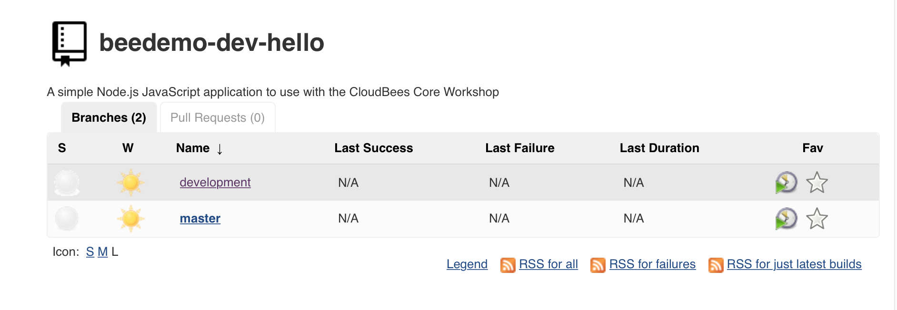

# CloudBees Pipeline Template Catalogs

Pipeline Template Catalogs provide version controlled paramaterized templates for Multibranch and stand-alone Pipeline jobs. In this exercise we will use a [Pipeline Template Catalogs](https://github.com/cloudbees-days/pipeline-template-catalog/tree/master/templates/nodejs-app) to create another Multibranch Pipeline project for your forked **helloworld-nodejs** repository. All you will need to do is fill in a few simple parameters and you will end up with a complete end-to-end CI/CD Pipeline for the **helloworld-nodejs** application.

## Create a Multibranch Project from a Pipeline Template Catalogs
[Jenkins Configurations as Code](https://wiki.jenkins.io/display/JENKINS/Configuration+as+Code+Plugin) (JCasC) was used to [pre-configure a Pipeline Template Catalog on everyone's Team Masters](https://github.com/kypseli/cb-core-mm/blob/kube-workshop/quickstart/init_07_pipeline_template_global_catalog.groovy) and there is a **template-jobs** folder in your Team Master named folder that has been configured (using the [CloudBees Folders Plus folder item filtering](https://go.cloudbees.com/docs/plugins/folders-plus/#folders-plus-sect-restrict)) to only allow the creation of jobs from that Catalog of templates. Now we will create a templatized end-to-end CI/CD Pipeline Multibranch project for your forked copy of the **helloworld-nodejs** repository.

1. On your Team Master navigate to the **template-jobs** folder
2. Click on the ***New Node.js App Multibranch Pipeline*** link in the left menu 

3. Enter an item name of your **[GitHub username]-hello**, select **Node.js App Multibranch Pipeline**  and click the **OK** button

4. Fill out the template parameters:
   1. **Repository Owner**: the GitHub Organization your created for the CloudBees Core workshop
   2. **GitHub Credential ID**: select the *username/password* credential you created for the the CloudBees Core workshop - it will show up as - [GitHub username]/******
   3. Click the **Save** button

5. You may need to refresh the Multibranch job screen, but eventually you should have two jobs - one for the **development** branch and one for the **master** branch

## Web Browser Tests with Testcafe

Executing [Testcafe](http://devexpress.github.io/testcafe/) driven browser tests for the **helloworld-nodejs** app in our Pipeline.

1. After you save the Pipeline Template job it will fail because the **Testcafe** test did not pass. We can see the exact error under the [**Tests** tab of the Blue Ocean Pipeline Run Details view](https://jenkins.io/doc/book/blueocean/pipeline-run-details/#tests) for this run: 

2. So it appears that we have a slight typo in our **helloworld-nodejs** app. Use the GitHub editor to open the `hello.js` file on the **development** branch of your forked copy of the **helloworld-nodejs** repository, fix the misspelling of **Worlld** to **World** and then commit the changes. 
3. Navigate to the **development** branch of your **helloworld-nodejs** job in Blue Ocean on your Team Master and your job should already be running as a GitHub webhook triggered it when you commited the changes for the `hello.js` file in the **helloworld-nodejs** repository. The tests will pass and the job will complete successfully: 

You may proceed to the next lab [*Lab 7. Cross Team Collaboration*](./cross-team-collaboration.md) or head back to the main list of the [**labs**](./README.md#workshop-labs) when you are ready.
