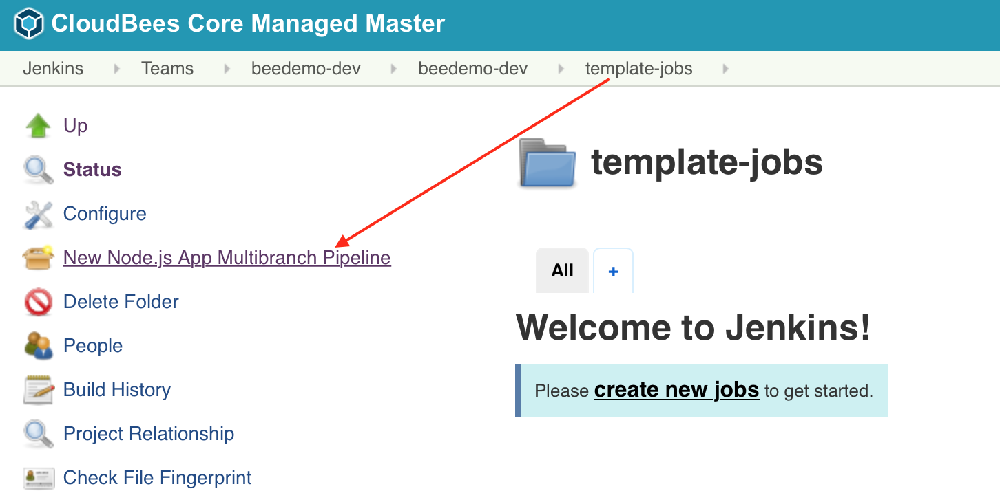
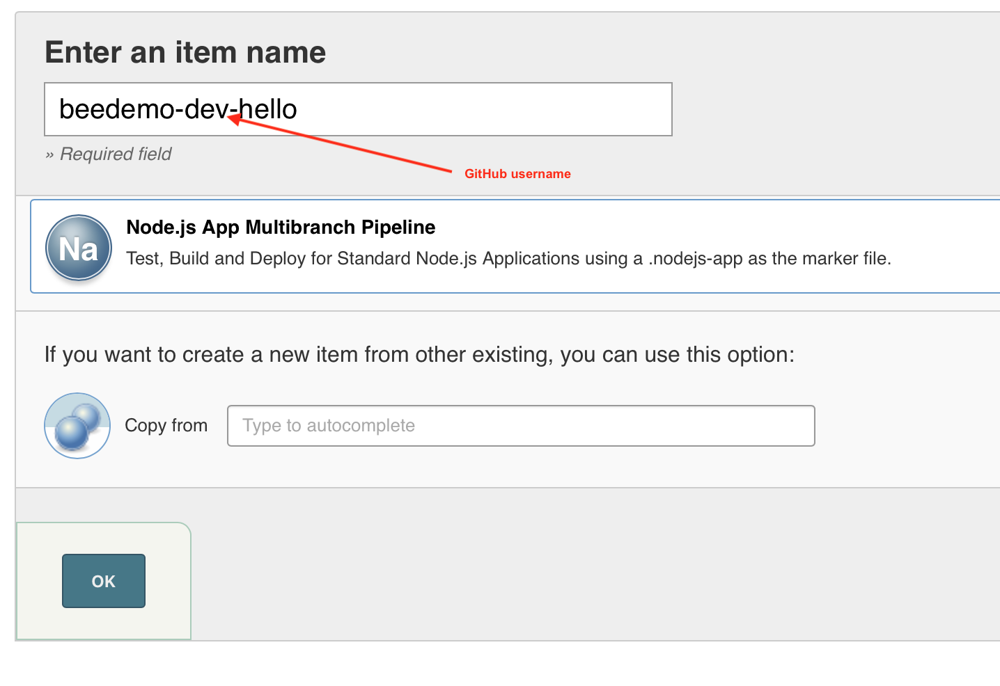
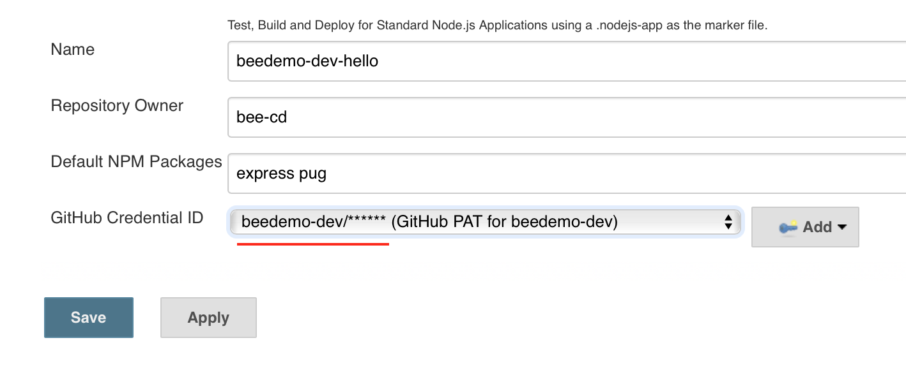
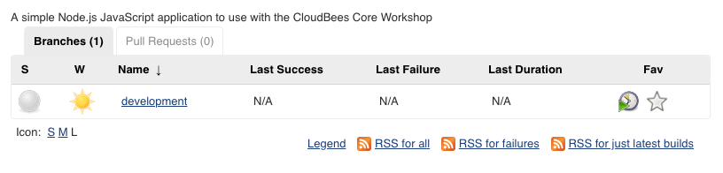
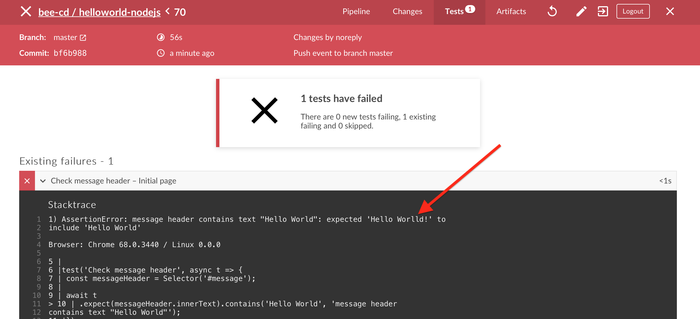
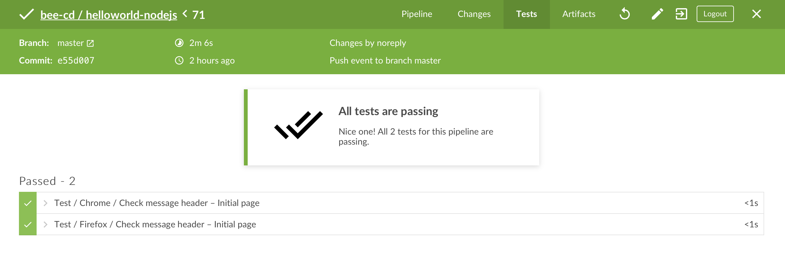

# CloudBees Pipeline Template Catalogs

Pipeline Template Catalogs provide version controlled paramaterized templates for Multibranch and stand-alone Pipeline jobs. In this exercise we will use a [Pipeline Template Catalogs](https://github.com/cloudbees-days/pipeline-template-catalog/tree/master/templates/nodejs-app) to create another Multibranch Pipeline project for your forked **helloworld-nodejs** repository. All you will need to do is fill in a few simple parameters and you will end up with a complete end-to-end CI/CD Pipeline for the **helloworld-nodejs** application - and it won't be using the `Jenkinsfile` from your repository.

## Create a Multibranch Project from a Pipeline Template Catalogs
[Jenkins Configurations as Code](https://wiki.jenkins.io/display/JENKINS/Configuration+as+Code+Plugin) (JCasC) was used to [pre-configure a Pipeline Template Catalog on everyone's Team Masters](https://github.com/kypseli/cb-core-mm/blob/kube-workshop/quickstart/init_07_pipeline_template_global_catalog.groovy) and there is a **template-jobs** folder in your Team Master named folder that has been configured (using the [CloudBees Folders Plus folder item filtering](https://go.cloudbees.com/docs/plugins/folders-plus/#folders-plus-sect-restrict)) to only allow the creation of jobs from that Catalog of templates. Now we will create a templatized end-to-end CI/CD Pipeline Multibranch project for your forked copy of the **helloworld-nodejs** repository.

1. On your Team Master navigate to the **template-jobs** folder
2. Click on the ***New Node.js App Multibranch Pipeline*** link in the left menu 

3. Enter an item name of your **[GitHub username]-hello**, select **Node.js App Multibranch Pipeline**  and click the **OK** button

4. Fill out the template parameters:
   1. **Repository Owner**: the GitHub Organization your created for the CloudBees Core workshop
   2. **GitHub Credential ID**: select the *username/password* credential you created for the the CloudBees Core workshop - it will show up as - [GitHub username]/******
   3. Click the **Save** button

5. The initial scan won't find any branches because you have to add the [custom markerfile](https://go.cloudbees.com/docs/cloudbees-core/cloud-admin-guide/pipeline/#_multibranch_pipeline_options_in_template_yaml) `.nodejs-app` to any branch that you want a job to be created. The [template we are using has a `markerFile` parameter set to `.nodejs-app`](https://github.com/cloudbees-days/pipeline-template-catalog/blob/master/templates/nodejs-app/template.yaml#L29), so we need to add that file to any repo we want to build. Start by adding it to the **development** branch of your forked copy of the **helloworld-nodejs** repository.
6. Make sure you are on the **development** branch and click on the **Create new  file** button towards the top right of the screen. 
7. Name the file `.nodejs-app` and commit the empty file to your **development** branch.
8. You may need to refresh the Multibranch job screen, but you should have only **one** job - for the **development** branch. 

## Web Browser Tests with Testcafe

Executing [Testcafe](http://devexpress.github.io/testcafe/) driven browser tests for the **helloworld-nodejs** app in our Pipeline.

1. After you add the custom marker file, your **development** branch job will run and it will fail because the **Testcafe** test did not pass. We can see the exact error under the [**Tests** tab of the Blue Ocean Pipeline Run Details view](https://jenkins.io/doc/book/blueocean/pipeline-run-details/#tests) for this run: 

2. So it appears that we have a slight typo in our **helloworld-nodejs** app. Use the GitHub editor to open the `hello.js` file on the **development** branch of your forked copy of the **helloworld-nodejs** repository, fix the misspelling of **Worlld** to **World** and then commit the changes. 
3. Navigate to the **development** branch of your **helloworld-nodejs** job in Blue Ocean on your Team Master and your job should already be running as a GitHub webhook triggered it when you commited the changes for the `hello.js` file in the **helloworld-nodejs** repository. The tests will pass and the job will complete successfully: 

## Deploy to Staging
Now that you have fixed the small bug in the **helloworld-nodejs** application, we will create a Pull Request and merge the change to the **master** branch of your forked copy of the **helloworld-nodejs** repository.

1. Navigate to your forked **helloworld-nodejs** repository in GitHub - click on the **New pull request** button 

2. Change the **base repository** to the **master** branch of your forked **helloworld-nodejs** repository (not the **cloudbees-days** repository), add a comment and then click the **Create pull request** button
3. A job will be created for the pull request and once it has completed successfully your pull request will show that **All checks have passed**. Go ahead and click the **Merge pull request** button and then click the **Confirm merge** button but **DO NOT DELETE** the **development** branch
4. Navigate to the **helloworld-nodejs** Pipeline Template Catalog job in Blue Ocean on your Team Master and the job for the **master** branch should be running or queued to run
5. The templated job will build a Docker image for your **helloworld-nodejs** application, push the image to the Google Container Registry (GCR), and then deploy your containerized application to a staging environment in Kubernetes - a link to your application will be available in the logs of your job. 

### GitOps with Core v2
As part of the deployment to *staging* the Pipeline Template Catalog job will create a new **environment-staging** repository in your workshop GitHub Organization with the generated Kubernetes deployment yaml used for the deployment to the K8s *staging* environment.

~~### Cross Team Collaboration
In addition to deploying to the *staging* environment, the Pipeline Template will also pubslish a Cross Team Collaboration event `containerImagePush` that the Core Workshop security team is listening for - anytime that this event is publish a job will be triggered on the **team-sec** Team Master to scan the image you just published with [Anchore](https://anchore.com/). Your application will not be deployed to production unless it passes this scan.

You may proceed to the next lab [*Lab 6. Cross Team Collaboration*](./cross-team-collaboration.md) or head back to the main list of the [**labs**](./README.md#workshop-labs) when you are ready.
