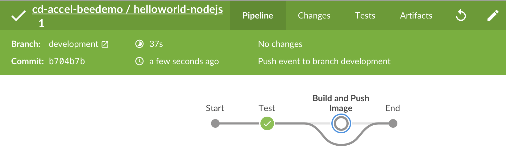
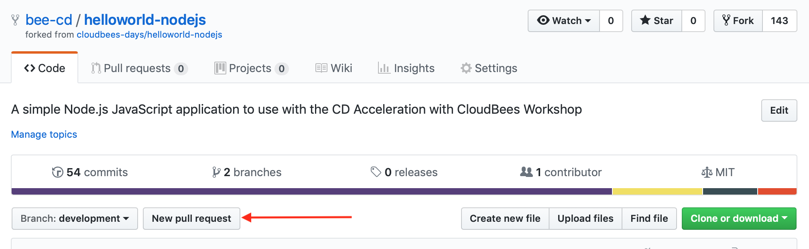
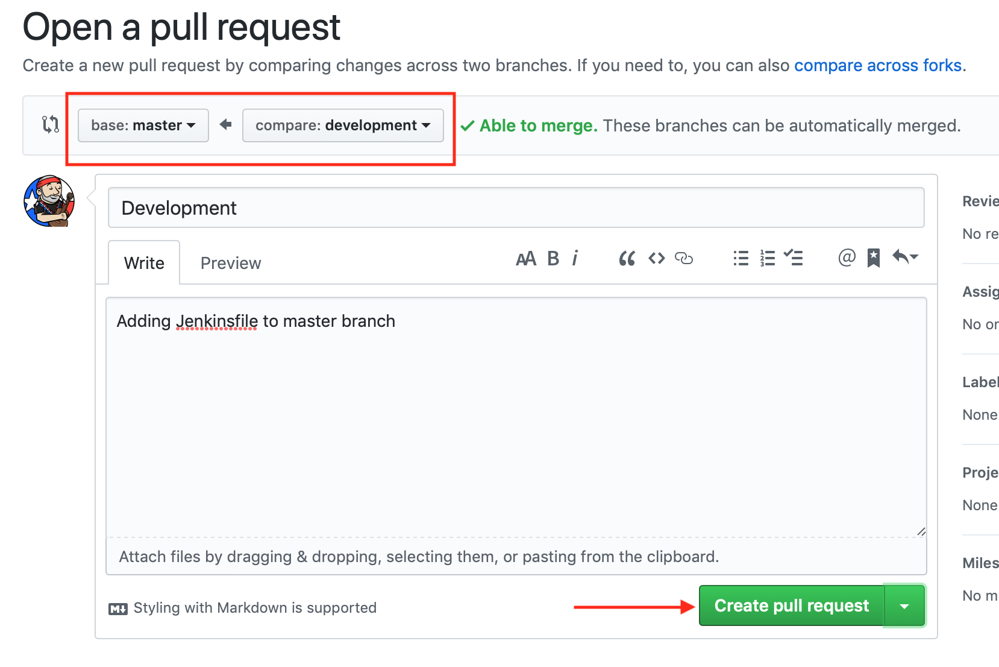
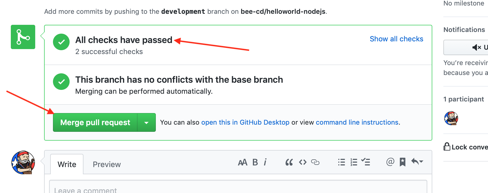
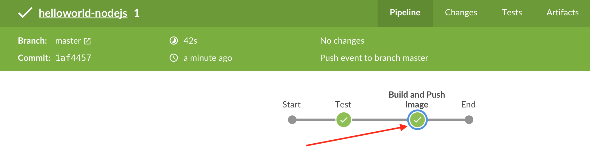

# Conditional Execution using the `when` directive

In this exercise we will edit the `Jenkinsfile` file in your forked **helloworld-nodejs** repository with conditional execution using the [`when` directive](https://jenkins.io/doc/book/pipeline/syntax/#when). We will accomplish this by adding a branch specific `stage` to the `Jenkinsfile` in your forked **helloworld-nodejs** repository.

1. Navigate to and open the GitHub editor for the `Jenkinsfile` file in **development** branch of your forked **helloworld-nodejs** repository
2. Insert the ***Build and Push Image*** stage after the existing **Test** stage and note the `beforeAgent true` option - this setting will result in the `when` condition being evaluated before acquiring and entering an `agent` for the `stage`. The `branch` condition is a built-in condition that allows executing stages only for specific branches - in this case the ***Build and Push Image*** `stage` will only execute for the **master** branch. The entire Pipeline shoud match what is below:

```
pipeline {
  agent { label 'nodejs-app' }
  options { 
    buildDiscarder(logRotator(numToKeepStr: '2'))
    skipDefaultCheckout true
  }
  stages {
    stage('Test') {
      steps {
        checkout scm
        container('nodejs') {
          echo 'Hello World!'   
          sh 'node --version'
        }
      }
    }
    stage('Build and Push Image') {
      when {
         beforeAgent true
         branch 'master'
      }
      steps {
         echo "TODO - build and push image"
      }
    }
  }
}
```
> **NOTE:** Most of the Pod Spec is cookie cutter and the only values we really care about are the `containers` `-name` and `image` - everthing else will typically always be the same.

3. Commit the changes and then navigate to the **helloworld-nodejs** job in Blue Ocean on your Team Master and the job for the **development** branch should be running or queued to run. Note that the ***Build and Push Image*** `stage` was skipped. <p>
4. Now we will create a [Pull Request](https://help.github.com/en/articles/creating-a-pull-request) between the **development** branch and **master** branch of your forked **helloworld-nodejs** repository. Navigate to your forked **helloworld-nodejs** repository in GitHub - click on the **New pull request** button <p>
5. Change the **base repository** to the **master** branch of your forked **helloworld-nodejs** repository (not the **cloudbees-days** repository), add a comment and then click the **Create pull request** button <p>
6. A job will be created for the pull request and once it has completed successfully your pull request will show that **All checks have passed**. Go ahead and click the **Merge pull request** button and then click the **Confirm merge** button but DO NOT delete the **development** branch <p>
7. Navigate to the **helloworld-nodejs** job in Blue Ocean on your Team Master and the job for the **master** branch should be running or queued to run. Click on the run and after it has completed notice that the ***Build and Push Image*** stage was not skipped <p>

## Next Lesson

Before moving on to the next lesson make sure that your **Jenkinsfile** Pipeline script on the **master** branch of your forked **helloworld-nodejs** repository matches the one from [below](#finished-jenkinsfile-for-introduction-to-pipelines-with-cloudbees-core).

### Finished Jenkinsfile for *Introduction to Pipelines with CloudBees Core*
```
pipeline {
  agent { label 'nodejs-app' }
  options { 
    buildDiscarder(logRotator(numToKeepStr: '2'))
    skipDefaultCheckout true
  }
  stages {
    stage('Test') {
      steps {
        checkout scm
        container('nodejs') {
          echo 'Hello World!'   
          sh 'node --version'
        }
      }
    }
    stage('Build and Push Image') {
      when {
        beforeAgent true
        branch 'master'
      }
      steps {
        echo "TODO - build and push image"
      }
    }
  }
}
```

You may proceed to the next set of [**labs**](./README.md#workshop-labs) - when your are you ready with this lab.
