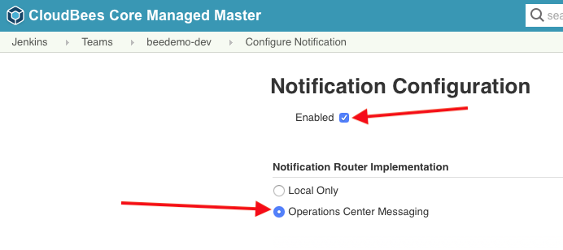
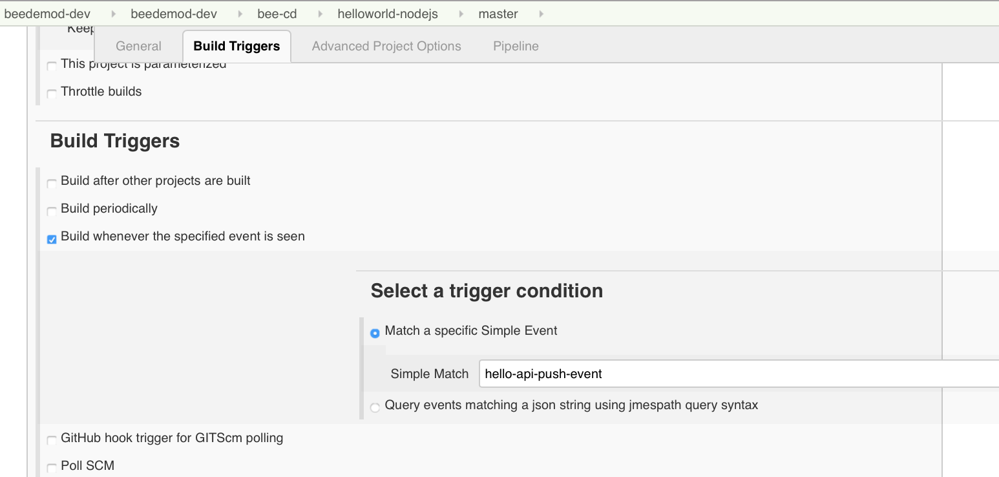
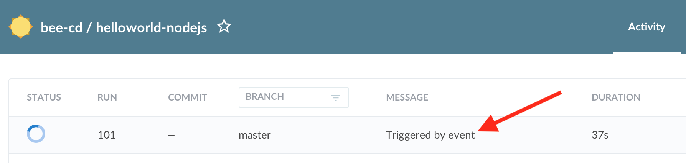

# CloudBees Cross Team Collaboration

In this exercise we will explore the [CloudBees Core Cross Team Collaboration feature](https://go.cloudbees.com/docs/cloudbees-core/cloud-admin-guide/cross-team-collaboration/). Cross Team Collaboration simplifies the cumbersome and complicated tasks of triggering downstream jobs by eliminating the need to identify and maintain the full path for every downstream job. Simply put it, this proprietary feature connects pipelines, increasing automation and collaboration. Prior to this feature, the details of every downstream job (Jenkins instance ID, full job name, Git branch name) all had to meticulously specified in the upstream job. If the job name changed, the upstream job had to be refactored, creating a maintenance burden and discouraging the adoption of event-based triggers.

## Cross Team Collaboration Events

The [Cross Team Collaboration feature](https://go.cloudbees.com/docs/cloudbees-core/cloud-admin-guide/cross-team-collaboration/) is designed to greatly improve team collaboration by connecting team Pipelines to deliver software faster. It essentially allows a Pipeline to create a notification event which will be consumed by other Pipelines waiting on it. It consists of a [**Publishing Event**](https://go.cloudbees.com/docs/cloudbees-core/cloud-admin-guide/cross-team-collaboration/#cross-team-event-publishers) and a [**Trigger Condition**](https://go.cloudbees.com/docs/cloudbees-core/cloud-admin-guide/cross-team-collaboration/#cross-team-event-triggers).

The Cross Team Collaboration feature has a configurable router for routing events and it needs to be configured on your Team Master before you will be able to receive the event published by another Team Master. Once again, CasC was used to pre-configure this for everyone, but you can still check it by going to the top-level of your Team Master in the classic UI, clicking on **Manage Jenkins** and then clicking on **Configure Notification** - you should see the following configured: <p>

1. Now our pipeline must must be updated to listen for a **hello-api-deploy-event** event. We will do that by adding a `trigger` to your **Jenkinsfile** Pipeline script.
2. Open the GitHub editor for the **Jenkinsfile** file in the **master** branch of your forked **helloworld-nodejs** repository.
3. Add the following `trigger` block just above the top-level `stages` block:

```groovy
  triggers {
    eventTrigger simpleMatch('hello-api-deploy-event')
  }
```

4. Commit the changes and then navigate to the **master** branch of your **helloworld-nodejs** job in Blue Ocean on your Team Master. 

>**NOTE:**After first adding a new `trigger` you must run the job at least once so that the `trigger` is saved to the Jenkins job configuration (similar to what was necessary for the `buildDiscarder` `option` earlier). <p>

Now I will set up a Multibranch Pipeline project for the https://github.com/cloudbees-days/helloworld-api repository and add the following [simple event](https://go.cloudbees.com/docs/cloudbees-core/cloud-admin-guide/cross-team-collaboration/#cross-team-event-types) to the **Deploy** stage of the **helloworld-api** `Jenkinsfile` : 

```
publishEvent simpleEvent('hello-api-deploy-event')
```

That event will be published **across all Team Masters in our Workshop cluster** via the CloudBees Operations Center event router causing everyones' **helloworld-nodejs** Pipelines to be triggered. 

Now I, once I commit that change, and run the **helloworld-api** job and everyone should see the **master** branch of their **helloworld-nodejs** job triggered. <p>

After you have completed the above exercises, you can make sure that your **Jenkinsfile** Pipeline script is correct by comparing to or copying from [below](https://github.com/cloudbees-days/cloudbees-core-workshop/blob/master/cross-team-collaboration.md#finished-jenkinsfile-for-pipeline-pod-temaplates-and-cross-team-collaboration).

## Next Lesson

Before moving on to the next lesson make sure that your **Jenkinsfile** Pipeline script on the **master** branch of your forked **helloworld-nodejs** repository matches the one from [below](#finished-jenkinsfile-for-pipeline-pod-templates-and-cross-team-collaboration).

### Finished Jenkinsfile for *Pipeline Pod Templates and Cross Team Collaboration*
```
pipeline {
  agent none
  options { 
    buildDiscarder(logRotator(numToKeepStr: '2'))
    skipDefaultCheckout true
  }
  triggers {
    eventTrigger simpleMatch('hello-api-deploy-event')
  }
  stages {
    stage('Test') {
      agent {
        kubernetes {
          label 'nodejs-app-inline'
          yamlFile 'nodejs-pod.yaml'
        }
      }
      steps {
        checkout scm
        container('nodejs') {
          echo 'Hello World!'   
          sh 'node --version'
        }
      }
    }
    stage('Build and Push Image') {
      when {
        beforeAgent true
        branch 'master'
      }
      steps {
        echo "TODO - build and push image"
      }
    }
  }
}
```

You may proceed to the next lab [*Lab 7. Pipeline with Interactive Input*](./input.md) or head back to the main list of the [**labs**](./README.md#workshop-labs) when you are ready.
