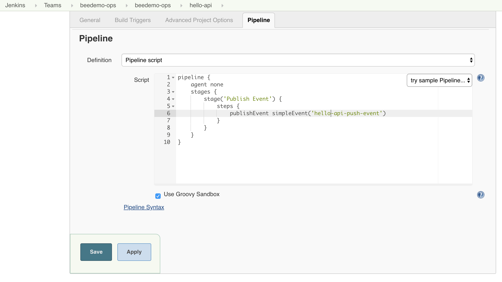
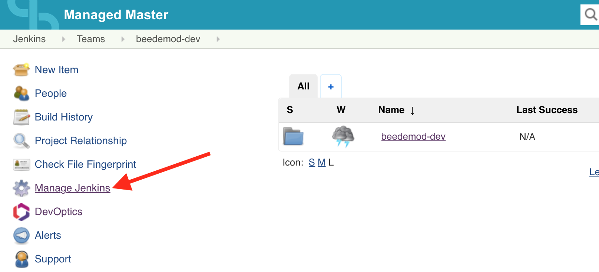
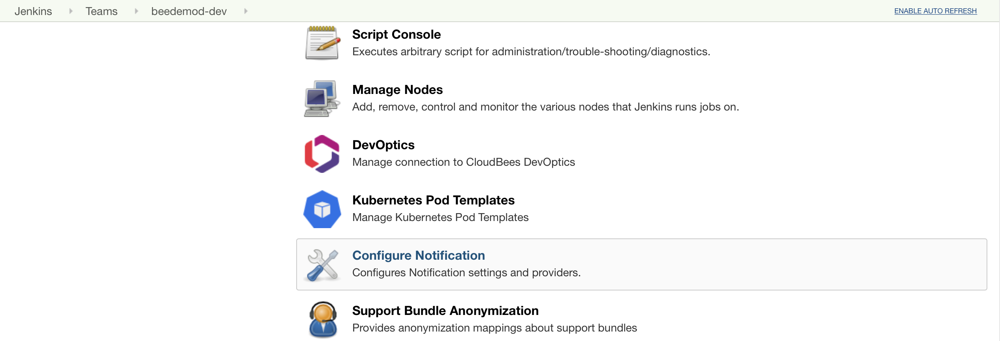
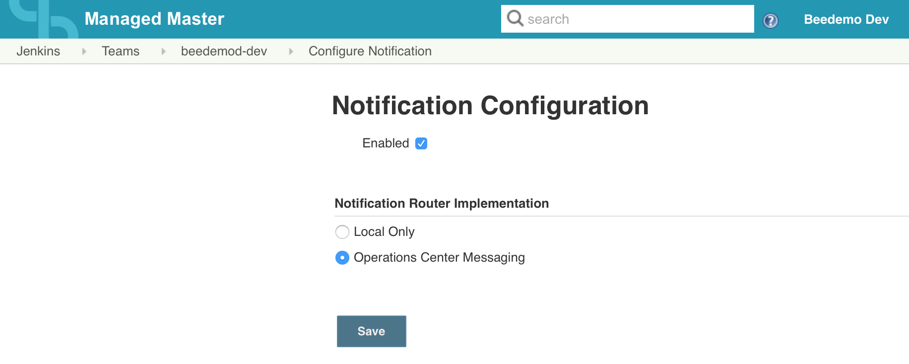

# Cross Team Collaboration

In this exercise we are going to demonstrate [CloudBee's Core Cross Team Collaboration feature](https://go.cloudbees.com/docs/cloudbees-core/cloud-admin-guide/cross-team-collaboration/).

### Cross-Team Master Events

We already have a job on the **beedemo-ops** Team Master that will publish an event. <p>

That event will be published **across Team Masters** via the CloudBees Operations Center event router. 

The Cross Team Collaboration feature has a configurable router for routing events and you will need to configure the Notification router on your Team Master before you will be able to receive the event published by the **beedemo-ops** Team Master.

1. First you need to update the **Notification Router Implementation** to use the **Operations Center Messaging** router by clicking on the **Manage Jenkins** link - on the left side at the root of your Team Master (classic ui). <p>
2. Next, scroll down and click on **Configure Notification** link. <p>
3. Check the **Enabled** checkbox and under **Notification Router Implementation** select the **Operations Center Messaging** option, and the click the **Save** button. <p>
4. Before the **hello-api** Pipeline's `hello-api-push-event` can trigger our **helloworld-nodejs** Pipeline job we must listen for the event. We do that by adding a `trigger` to our **nodejs-app/Jenkinsfile.template** Pipeline script.
5. Open the GitHub editor for the **nodejs-app/Jenkinsfile.template** Pipeline script in the **master** branch of your forked **custom-marker-pipelines** repository.
6. Add the following `trigger` block just above the top-level `stages` block:

```groovy
  triggers {
    eventTrigger simpleMatch('hello-api-push-event')
  }
```

7. Commit the changes and then navigate to the **master** branch of your **helloworld-nodejs** job in Blue Ocean on your Team Master and run the job. 

>**NOTE:**After first adding a new `trigger` you must run the job at least once so that the `trigger` is saved to the Jenkins job configuration (similar to what was necessary for the `buildDiscarder` and `preserveStashes` `options` earlier). 

<p>

8. Now I will run the **hello-api** job and everyone should see the **master** branch of their **helloworld-nodejs** job triggered. <p>