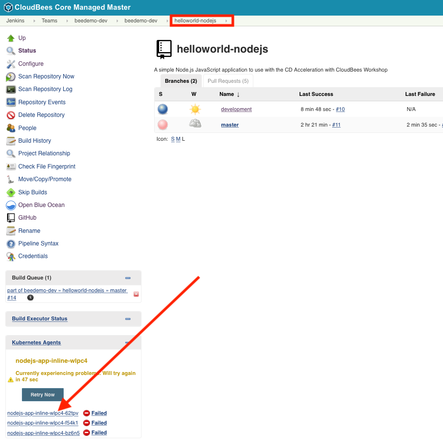
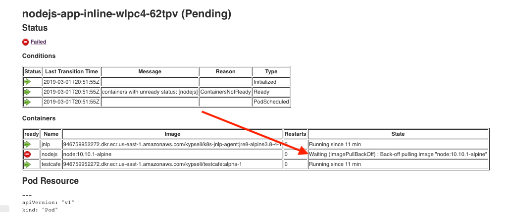
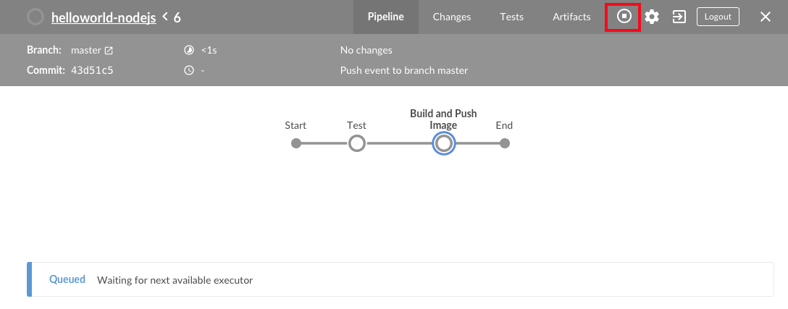
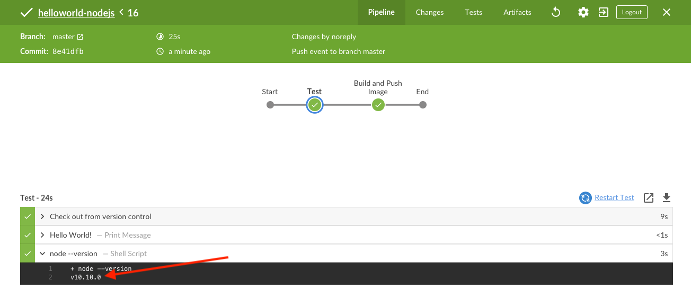

# Custom Pipeline Pod Templates

## Kubernetes Pod Templates Defined in Pipeline Script

In this lab we will create our own K8s Pod Template with nodejs and another Docker **container** for executing tests. We also want to use a different version of the **node** Docker image than the one provided by the Master managed Pod Template which is `node:8.12.0-alpine`. So far we have been using the **nodejs-app** [Kubernetes *Pod Template* defined for us at our Team Master level](https://go.cloudbees.com/docs/cloudbees-core/cloud-admin-guide/agents/#_editing_pod_templates_per_team_using_masters). In order to be able to control what `containers` and what Docker `image` version we use in our Pipeline we will update the **Jenkinsfile** Pipeline script with an [*Kubernetes Pod Template definition](https://github.com/jenkinsci/kubernetes-plugin#declarative-pipeline).

1. The [Jenkins Kubernetes plugin allows you to use standard Kubernetes Pod yaml configuration](https://github.com/jenkinsci/kubernetes-plugin#using-yaml-to-define-pod-templates) to define Pod Templates directly in your Pipeline script. We will do just that in a new `nodejs-pod.yaml` file. The `yamlFile` parameter value of the `kubernetes` agent definition is a repository relative path to a yaml file representing the [Pod spec](https://kubernetes.io/docs/reference/generated/kubernetes-api/v1.11/#pod-v1-core) you want to use as an agent Pod Template. At the top-level of the **master** branch of your forked copy of the **helloworld-nodejs** repository click on the **Create new  file** button towards the top right of the screen. 
2. Name the file `nodejs-pod.yaml` and add the following content:
```
kind: Pod
metadata:
  name: nodejs-app
spec:
  containers:
  - name: nodejs
    image: node:10.10.1-alpine
    command:
    - cat
    tty: true
  - name: testcafe
    image: gcr.io/technologists/testcafe:0.0.1
    command:
    - cat
    tty: true
```

3. At the bottom of the screen enter a commit message, leave ***Commit directly to the `master` branch** selected and click the **Commit new file** button
4. Now we need to update our Pipeline to use that file. Open the GitHub editor for the **Jenkinsfile** Pipeline script in the **master** branch of your forked **helloworld-nodejs** repository.
5. Replace the `agent` section of the **Test** `stage` with the following - note that the valule of the `yamlFile` parameter is the name of the file we created:

```
      agent {
        kubernetes {
          label 'nodejs-app-pod'
          yamlFile 'nodejs-pod.yaml'
        }
      }
```


6. Commit the changes and then navigate to the **master** branch of your **helloworld-nodejs** job in Blue Ocean on your Team Master. The job will queue indefinitely, but why? 
7. The answer is provided by the [CloudBees Kube Agent Management plugin](https://go.cloudbees.com/docs/cloudbees-core/cloud-admin-guide/agents/#monitoring-kubernetes-agents). Exit to the classic UI on your Team Master and navigate up to the **helloworld-nodejs** Multibranch folder. On the bottom left of of the screen there is a dedicated widget that provides information about the ongoing provisioning of Kubernetes agents. It also highlights failures, allowing you to determine the root cause of a provisioning failure. Click on the link for the failed or pending pod template. <p>
8. You will see that the **nodejs** container has an error - it looks like there is not a **node** container image available with that tag. If you go to [Docker Hub and look at the tags available for the **node** image](https://hub.docker.com/r/library/node/tags/) you will see there is a **10.10.0-alpine** but not a **10.10.1-alpine** tag for the **node** image: <p> 
9. Abort the current run (or it will keep trying to load that faulty pod template forever) <p> 
10. Next, open the GitHub editor for the **nodejs-pod.yaml** Pipeline script in the **master** branch of your forked **helloworld-nodejs** repository. Update the `image` for the **nodejs** `container` to be `node:10.10.0-alpine` and commit the changes.
11. Next, open your **Jenkinsfile** and update `kubernetes` `label` to **nodejs-app-pod-2**. 
12. Commit the changes and then navigate to the **master** branch of your **helloworld-nodejs** job in Blue Ocean on your Team Master. The job will run successfully. Also, note the output of the `sh 'node --version'` step - it is `v10.10.0` instead of `v8.12.0`: <p>

### Finished Jenkinsfile for *Custom Pipeline Pod Templates*
```
pipeline {
  agent none
  options { 
    buildDiscarder(logRotator(numToKeepStr: '2'))
    skipDefaultCheckout true
  }
  stages {
    stage('Test') {
      agent {
        kubernetes {
          label 'nodejs-app-pod-2'
          yamlFile 'nodejs-pod.yaml'
        }
      }
      steps {
        checkout scm
        container('nodejs') {
          echo 'Hello World!'   
          sh 'node --version'
        }
      }
    }
    stage('Build and Push Image') {
      when {
        beforeAgent true
        branch 'master'
      }
      steps {
        echo "TODO - build and push image"
      }
    }
  }
}
```

You may proceed to the next lab [*Lab 5. CloudBees Pipeline Template Catalogs*](./catalog-templates.md) or head back to the main list of the [**labs**](./README.md#workshop-labs) when you are ready.
