# Introduction to Pipelines with CloudBees Core

In this first exercise we will create a Multibranch Pipeline project, get an overview of the basic fundamentals of the Declarative Pipeline syntax, get an introduction to Kubernetes based agents and learn how to add conditional logic to a Declarative Pipeline.

## Add GitHub Credentials to Your Team Master

We must exit the Blue Ocean UI to the Jenkins classic UI to complete the steps in this exercise.

1. Click the ***Go to classic*** icon at the top of common section of Blue Ocean’s navigation bar. <p>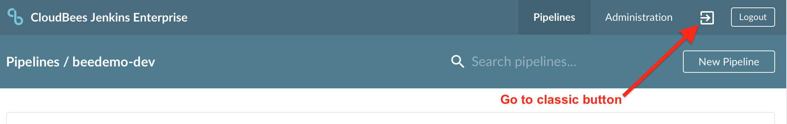

Now, let's add your GitHub personal access token to the Jenkins' Credentials manager to be used for both GitHub webhook management and the *Multibranch Pipeline* project we will create:

1. Navigate to the top-level of your Team Master - this should be one level-up from where you exit the Blue Ocean UI. You should see a **Manage Jenkins** link in the left navigation menu.
2. Click on the **Credentials** link in the left navigation menu. <p>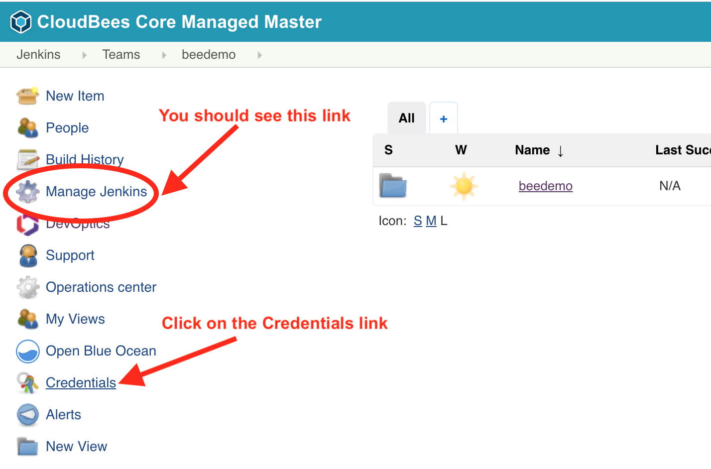
3. Click on the **github.com** link under **Stores scoped to Jenkins** <p>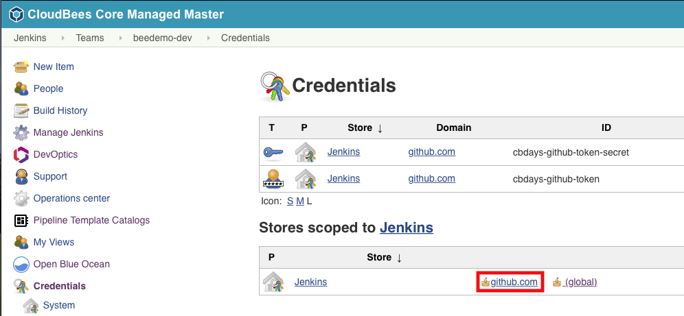 - storing it in this scope will only allow the credential to be used for *github.com* URLs.
4. Click on **Add Credentials** in the left menu <p>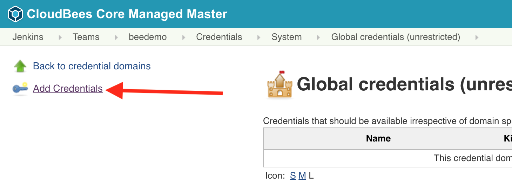
5. Fill out the form (**Username with password**)
  - **Username**: The GitHub user name
  - **Password**: Your GitHub personal access token [created in setup](../Setup.md#create-a-github-personal-access-token) OR [here is the GitHub link to automatically select the required **Personal access token settings** if you haven't alreaedy done it](https://github.com/settings/tokens/new?scopes=repo,read:user,user:email,admin:repo_hook)
  - **ID**: Create an ID for your credentials (something like **yourorg-github-token**)
  - **Description**: Can be left blank if you want <p>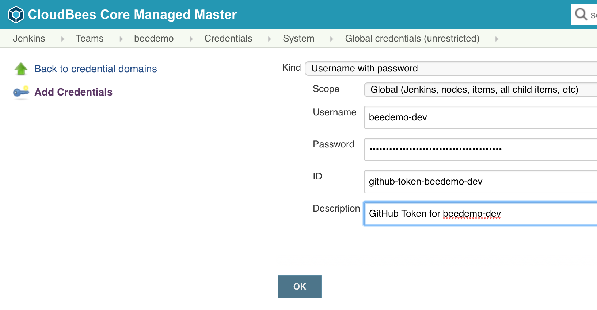
6. Click on **OK**

Now we need to add another credential for the Jenkins GitHub global configuration in order for Jenkins to automatically create webhooks for us when we add and GitHub repositories to a Jenkins job as we will do when we create a Multibranch Pipeline project in the next exercise. The *GitHub Plugin Configuration* global configuration requires the **Secret text** credential type as opposed to **Username with password**.

1. Click on **Add Credentials** in the left menu <p>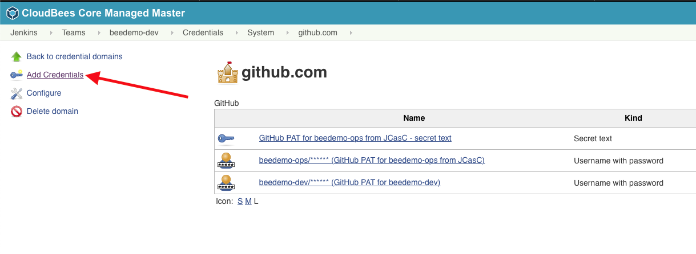
2. Select **Secret text** from the Credential **Kind** drop down <p>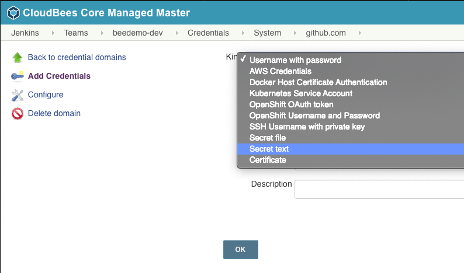
3. [Enter your GitHub personal access token as the value for the **Secret**, pro](Fill out the form (**Username with password**)
  - **Secret**: Your GitHub personal access token [created in setup](../Setup.md#create-a-github-personal-access-token) OR [here is the GitHub link to automatically select the required **Personal access token settings** if you haven't alreaedy done it](https://github.com/settings/tokens/new?scopes=repo,read:user,user:email,admin:repo_hook)
  - **ID**: Create an ID for your credentials (something like **github-{username}-secret** - it must be different than the ID used for the **Username with password** credential you created above)
  - **Description**: Can be left blank if you want <p>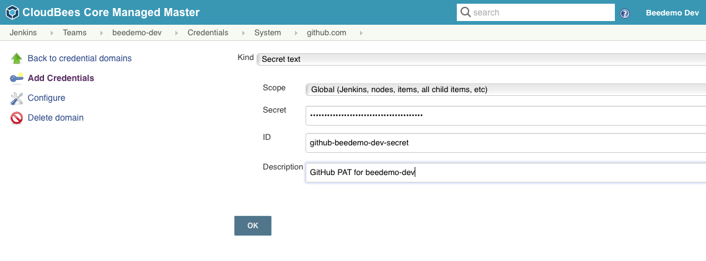)
4. Click on **OK**

## Enable Webhook Management for GitHub

In this exercise we will add a GitHub server configuration to enable Jenkins to manage GitHub webhooks for us.

1. Navigate to the top-level of your Team Master - this should be one level-up from where you exit the Blue Ocean UI. You should see a **Manage Jenkins** link in the left navigation menu.
2. Click on the **Manage Jenkins** link in the left navigation menu and then click on **Configure System**. <p>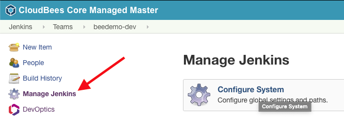
3. Scroll down to the **GitHub** section and click on the **Add GitHub Server** button and then click on **GitHub Server**. <p>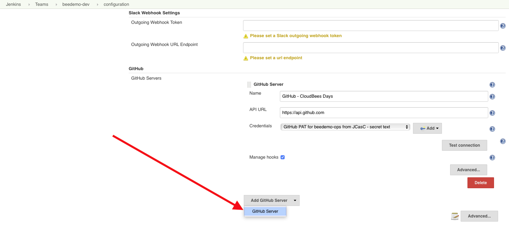
4. Fill out the form (**GitHub Server**)
  - **Name**: *GitHub - {username}*
  - **API URL**: *https://api.github.com* (default)
  - **Credentials**: Select the **Secret text** credential your created above
  - **Manage hooks**: checked
5. Click the **Test connection** button to verify your configuration.
6. Click the **Save** button <p>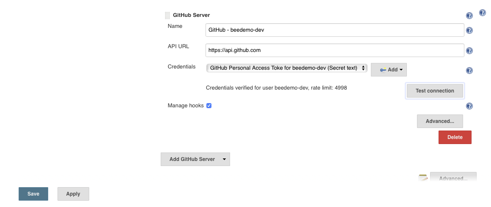

## Create a Multibranch Pipeline Project

In this exercise we are going to create a special type of Jenkins Pipeline project referred to as a [*Multibranch Pipeline*](https://jenkins.io/doc/book/pipeline/multibranch/#creating-a-multibranch-pipeline). The Jenkins *Multibranch Pipeline* project will scan a GitHub Repository to discover the branches of a repository, automatically creating a **managed** Pipeline Job for any branch containing a *project recognizer* - defaulting to a file named **Jenkinsfile**. We will use the GitHub repository that you forked in **[Setup - Fork the Workshop Repositories](./Setup.md#fork-the-workshop-repositories)**. A Jenkins *Multibranch Pipeline* project will also utilize a GitHub repository level webhook to automatically create and delete Jenkins jobs - when a branch (including pull requests) is added to or deleted from the GitHub repository.

In order to complete the following exercise you should have [forked the following repository](./Setup.md#fork-the-workshop-repositories) into the Github Organization you created in **[Setup - Create a GitHub Organization](./Setup.md#create-a-github-organization)**:

* https://github.com/cloudbees-cd-acceleration-workshop/helloworld-nodejs  


Once that repository is forked:

1. Navigate back to the top-level of your **Team Master** and click on the folder with the same name as your **Team Master**. This is important if you want to use [Blue Ocean](https://jenkins.io/projects/blueocean/) to visualize the Pipeline runs as only jobs under this folder will show up in Blue Ocean.<p> 
2. Click on **New Item** in the left navigation menu - make sure that you are in the folder with the same name as your team, and not at the root of your Team Master <p>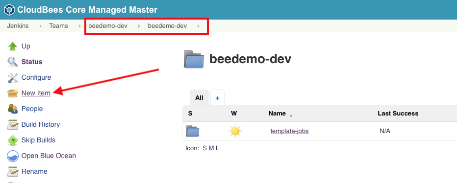 
3. Enter **helloworld-nodejs** as the **Item Name** 
4. Select **Multibranch Pipeline** and click **OK**<p>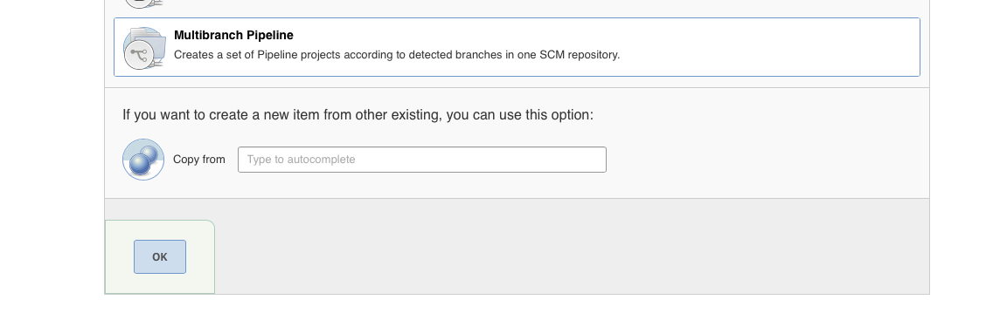
5. Under **Branch Sources** click on **Add source** and select **GitHub** <p>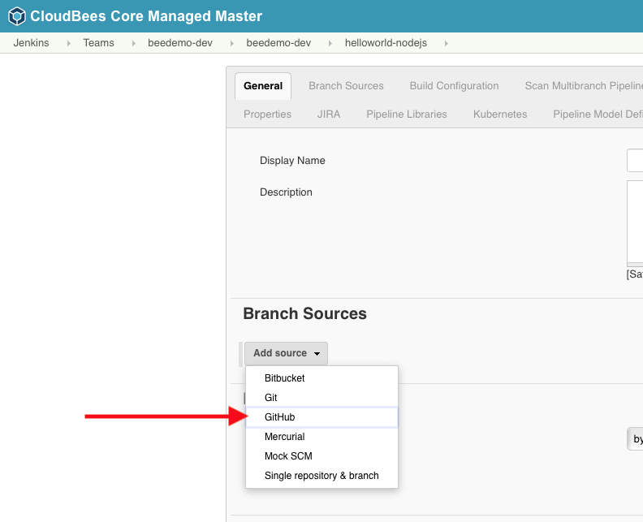
6. Select the **Username and password** credentials you created above from the **Credentials** drop down 
7. Make sure that the **Owner** field matches the name of your GitHub Organization name.
8. Select the **helloworld-nodejs** repository from your GitHub Organization (it should be the only repository in the Organization).
9. Click on **Save** <p>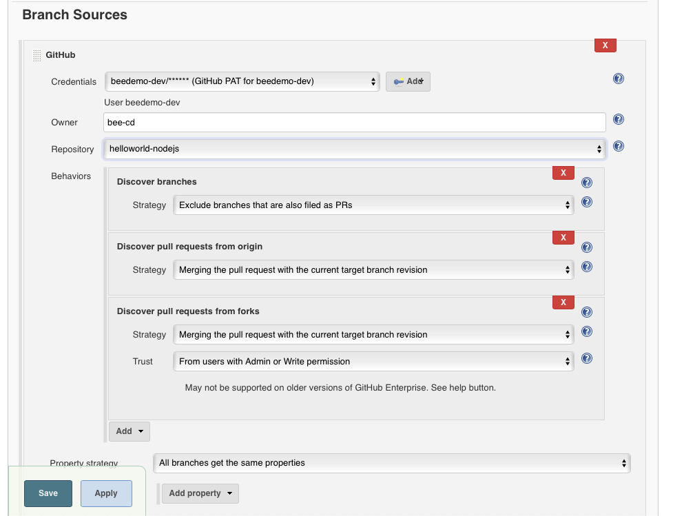
10. After the scan is complete, click on the bread-crumb link to go back to your **Multibranch Piepline** Jenkins project folder
11. When the scan is complete your **Multibranch Piepline** Jenkins project should be **empty**!<p>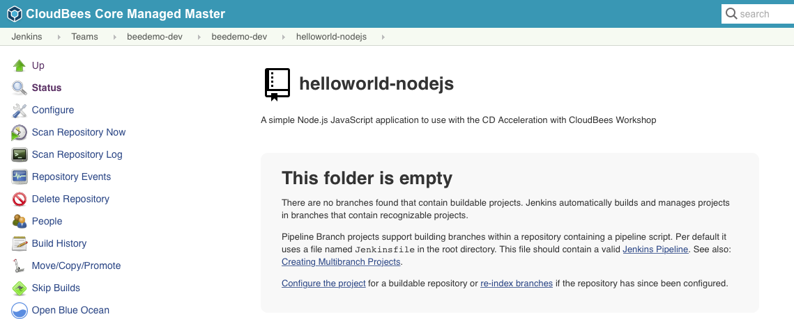
12. However, when the project was created it also should have created a webhook in Github. Verify that the webhook was created in Github by checking **Webhooks** within your GitHub repository **Settings**. <p>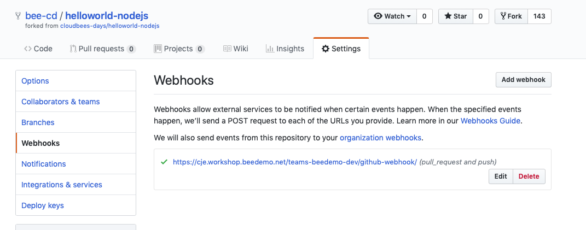
13. The reason why the scan did not find any branches is because there is no branch in your repository with a `Jenkinsfile` in it, so let's fix that. In your forked copy of the **helloworld-nodejs** repository click on the **Create new  file** button towards the top right of the screen. <p>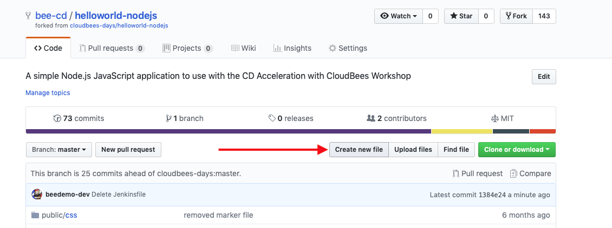
14. Name the file `Jenkinsfile` and add the following content:
```
pipeline {

}
```
15. At the bottom of the screen enter a commit message, select the **Create a new branch for this commit and start a pull request.** and click the **Propose new file** button to save it your repository.  <p>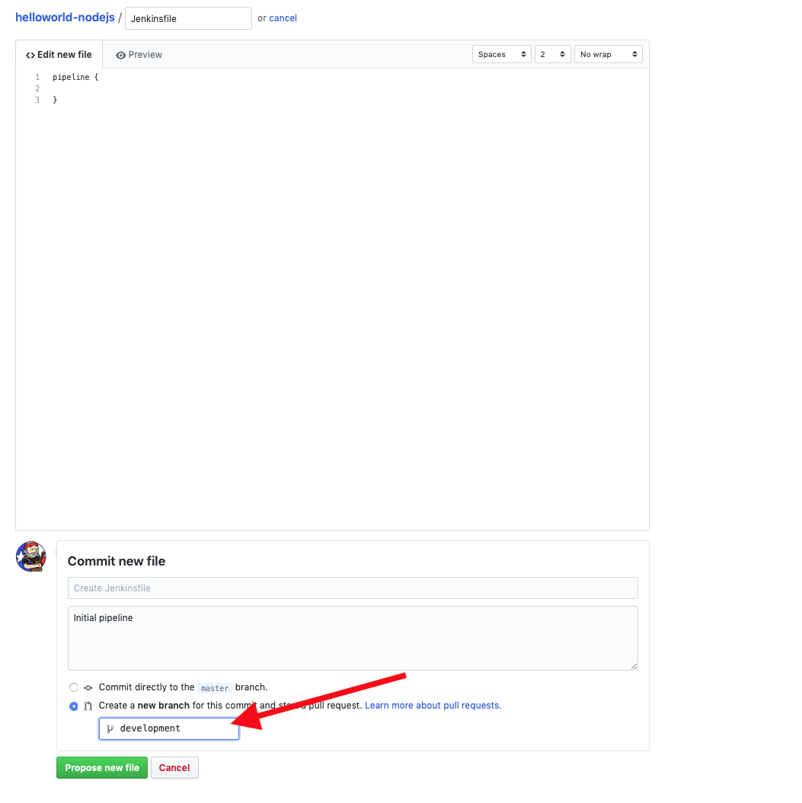
16. Navigatd back to your new Multibranch project in Jenkins and refresh the page. You should have a new job that failed <p>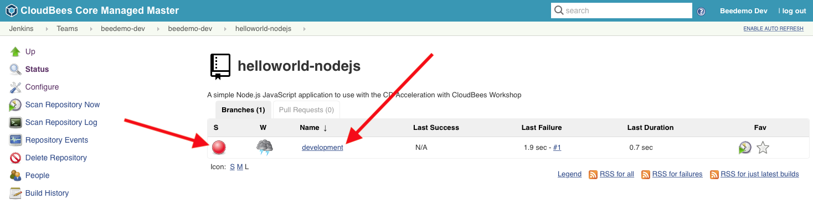

## Basic Declarative Syntax Structure

In the previous lesson your Pipeline ran and will have failed. <p>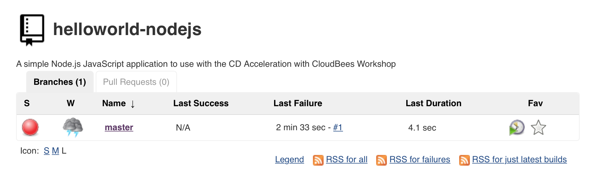

In this exercise we will update the Jenkinsfile Declarative Pipeline in your forked copy of the **helloworld-nodejs** repository using the GitHub file editor so that it will run successfully, as opposed to resulting in the following syntax errors:

```
WorkflowScript: 1: Missing required section "stages" @ line 1, column 1.
   pipeline {
   ^

WorkflowScript: 1: Missing required section "agent" @ line 1, column 1.
   pipeline {
   ^

2 errors
```

[Declarative Pipelines](https://jenkins.io/doc/book/pipeline/syntax/#declarative-pipeline) must be enclosed within a `pipeline` block - which we have. But Declarative Pipelines must also contain a top-level `agent` declaration, and must contain exactly one `stages` block at the top level. Typically, the `stages` block must have at least one `stage` block but can have an unlimited number of additional `stage` blocks. Each `stage` block must have exactly one `steps` block. 

1. We will use the GitHub file editor to update the `nodejs-app/Jenkinsfile.template` file in your forked **custom-marker-pipelines** repository. Navigate to the `custom-marker-pipelines/nodejs-app/Jenkinsfile.template` file in the **master** branch of your forked repository and then click on the pencil icon in the upper right to edit that file. <p>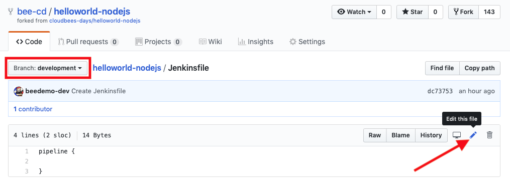

> NOTE: Remember we are using a CloudBees Core feature that allows us to specify a Pipeline script from a different source code repository than the one where the application code is committed. This may be a bit confusing at first as commits to your *template* will not trigger a build via GitHub webhooks because we aren't actually making a commit to the application repository.

2. Replace the contents of that file with the following Declarative Pipeline:

```groovy
pipeline {
  agent any
  stages {
    stage('Say Hello') {
      steps {
        echo 'Hello World!'   
        sh 'java -version'
      }
    }
  }
}
```

3. Add a commit description and then click the **Commit Changes** button with the default selection of *Commit directly to the master branch* selected.
4. Navigate back to the **helloworld-nodejs** *master* branch job on your Team Master and click the **Build Now** button in the left menu. <p>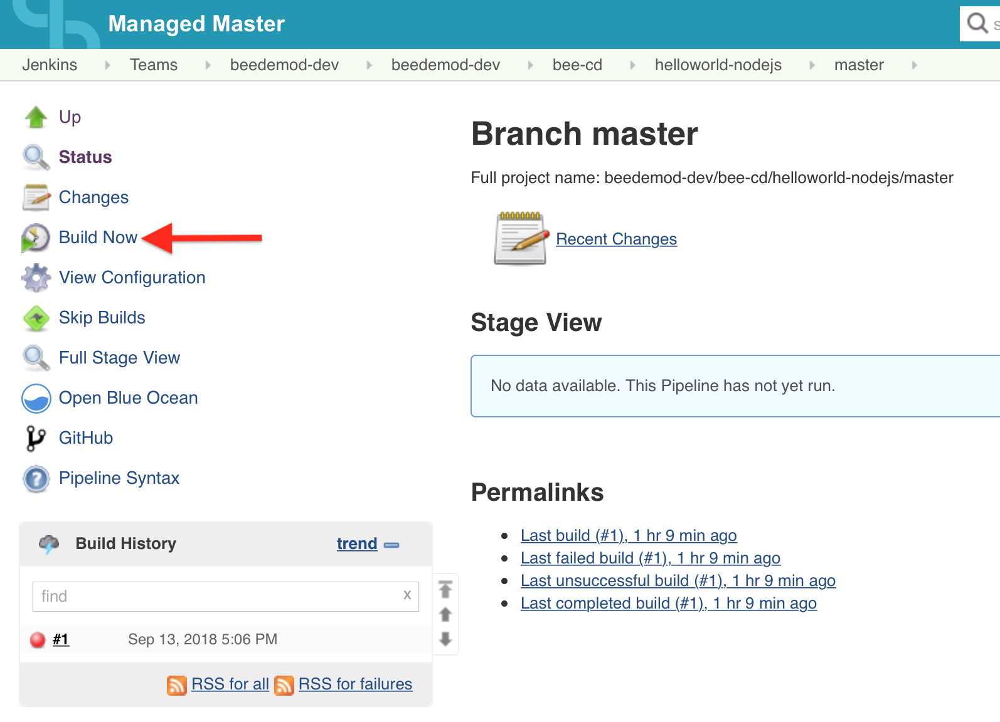
5. Your job will complete successfully. Note some things from the log:
  
   i. The custom marker script - `nodejs-app/Jenkinsfile.template` - is being pulled from your forked **custom-marker-pipelines** forked repository and not from the **helloworld-nodejs** repository:

  ```
  ...
  Obtained nodejs-app/Jenkinsfile.template from git https://github.com/cd-accel-beedemo/custom-marker-pipelines.git
  ...
  ```

   ii. The agent is being provisioned from a Kubernetes Pod Template (more on this in the next lesson):

  ```
  ...
  Agent default-jnlp-0p189 is provisioned from template Kubernetes Pod Template
  ...
  ```

   iii. Your fork of the **helloworld-nodejs** repository is being checked out, even though you did not put any steps in the `nodejs-app/Jenkinsfile.template` to do so:

  ```
  ...
  Cloning repository https://github.com/cd-accel-beedemo/helloworld-nodejs.git
  ...
  ```

   iv. The agent has a Java version of `1.8.0_171`:

```
...
Running shell script
+ java -version
openjdk version "1.8.0_171"
...
```
  
> **NOTE:** You may have noticed that your Pipeline GitHub repository is being checked out even though you didn't specify that in your Jenkinsfile. Declarative Pipeline checks out source code by default using the `checkout scm` step. Furthermore, this automatic checkout will occur in every `stage` that uses a different agent.

## The options Directive

The [`options` directive](https://jenkins.io/doc/book/pipeline/syntax/#options) allows configuring Pipeline-specific options from within the Pipeline itself. We are going to add the `buildDiscarder` `option` to the `nodejs-app/Jenkinsfile.template` file in your forked **custom-marker-pipelines** repository. As a centrally managed CD service, that will provide easy managment of the *Discard old builds* strategy across all of the jobs that use the `nodejs-app/Jenkinsfile.template` so that storage of the Jenkins home directory is less of an issue on the CloudBees Team Masters in your cluster.

1. Use the GitHub file editor to update the `nodejs-app/Jenkinsfile.template` file in your forked **custom-marker-pipelines** repository - adding the following `options` directive below the `agent` section:

```groovy 
  options { 
    buildDiscarder(logRotator(numToKeepStr: '2'))
  }
```

2. **Commit Changes** and then navigate to the **master** branch of your **helloworld-nodejs** job in the classic UI on your **Team Master** and run the job. Once the job has run at least once, the job configuation will be updated to reflect what was added to the Pipeline script. <p>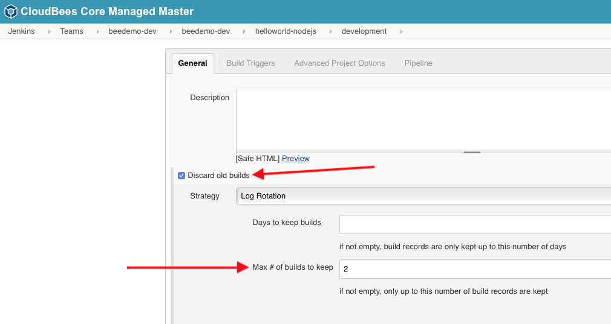

> **NOTE:** A Pipeline job must run in Jenkins before any type of Pipeline directive that modifies the job configuration can take effect because there is no way for the Jenkins master to know about it until it is runs on the Jenkins master. Also, note that for Multibranch Pipeline projects - the only way to modify much of the configuration of branch specific Pipeline jobs is by doing it in the Pipeline script as those jobs are not directly configurable from the Jenkins UI.

## Kubernetes Agents with CloudBees Core

In this exercise we will get an introduction to the [Jenkins Kubernetes plugin](https://github.com/jenkinsci/kubernetes-plugin/blob/master/README.md) for running dynamic and ephemeral agents in a Kubernetes cluster - leveraging the scaling abilities of Kubernetes to schedule build agents.

CloudBees Core has [OOTB support for Kubernetes build agents](https://go.cloudbees.com/docs/cloudbees-core/cloud-admin-guide/agents/#kubernete-agents). The Kubernetes based agent is contained in a pod, where a pod is a group of one or more containers sharing a common storage system and network. A pod is the smallest deployable unit of computing that Kubernetes can create and manage (you can read more about pods in the [Kubernetes documentation](https://kubernetes.io/docs/concepts/workloads/pods/pod/)).

>NOTE: One of the containers must host the actual Jenkins build agent (the slave.jar file that is used for communication between the CloudBees Team Master and the agent). By convention, this container always exists (and is automatically added to any Pod Templates that do not define a **Container Template** with the name ***jnlp*** ). Again, this special container has the ***Name*** `jnlp` and default execution of the Pipeline always happens in this `jnlp` container (as it did when we used `agent any` above) - unless you declare otherwise with a special Pipeline step provided by the Kuberentes plugin - the `container` step. If needed, this automatically provided `jnlp` container may be overridden by specifying a **Container Template** with the ***Name*** `jnlp` - but that **Container Template** must be able to connect to the Team Master via JNLP with a version of the Jenkins `slave.jar` that corresponds to the Team Master Jenkins verion or the Pod Template will fail to connect to the Team Master.

We will use the Kubernetes plugin provided [Pipeline `container` block](https://jenkins.io/doc/pipeline/steps/kubernetes/#container-run-build-steps-in-a-container) to run Pipeline `steps` inside a specific container configured as part of a Jenkins Kubernetes Agent Pod template. In our initial Pipeline, we used `agent any` which required at least one Jenkins agent configured to *Use this node as much as possible* - resulting in the use of a Pod Template that only had a `jnlp` container. But now we want to use Node.js in our Pipeline. Luckily, our CloudBees Core Jenkins Administrator has configured the [CloudBees Core Kubernetes Shared Cloud](https://go.cloudbees.com/docs/cloudbees-core/cloud-admin-guide/agents/#_globally_editing_pod_templates_in_operations_center) to include a Kubernetes Pod Template to provide a Node.js container. <p>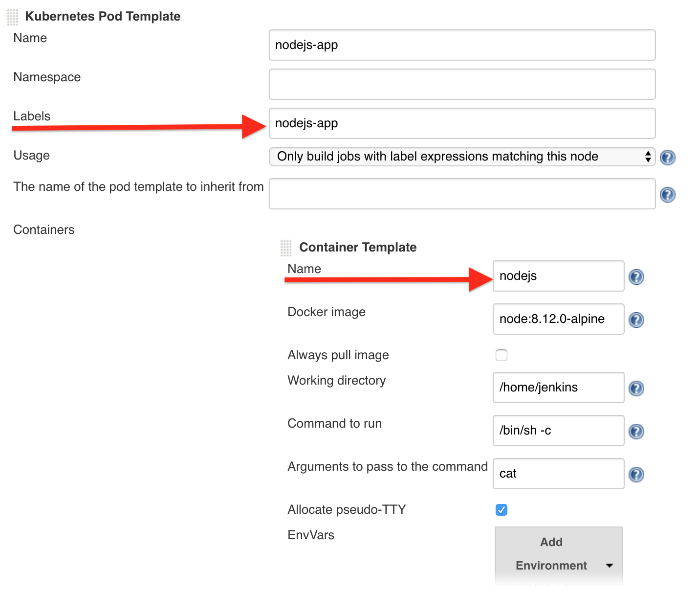 <p>Take note of the ***Labels*** field with a value of ***nodejs-app*** and the **Container Template** ***Name*** field with a value of ***nodejs*** - both of these are important and we will need those values to configure our Pipeline to use this **Pod Template** and **Container Template**.

1. Navigate to and click on the **nodejs-app/Jenkinsfile.template** in the file list within your forked **custom-marker-pipelines** repository
2. Click on the **Edit this file** button (pencil)
3. First, we need to update the `agent any` directive with the following so that we will get the correct Kubernetes Pod Template - configured with the **Container Template** that includes the `node:8.12.0-alpine` Docker image:
```
  agent { label 'nodejs-app' }
```
4. Navigate to the **master** branch of your **helloworld-nodejs** job in Blue Ocean on your Team Master and run the job. <p>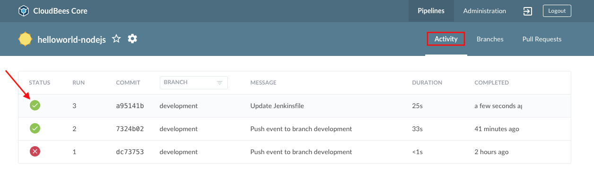 <p>The build logs should be almost the same as before - we are still using the default `jnlp` container. Let's change that by replacing the **Say Hello** `stage` with the following **Test** `stage`:

```groovy
    stage('Test') {
      steps {
        container('nodejs') {
          echo 'Hello World!'   
          sh 'java -version'
        }
      }
    }
```

  All of the Pipeline steps within that `container` block will run in the container specified by the **Name** of the **Container Template** - and in this case that **Container Template** is using the `node:8.12.0-alpine` Docker image. Run the **helloworld-nodejs** job again - it will result in an error because the `nodejs` container does not have Java installed (and why should it). <p>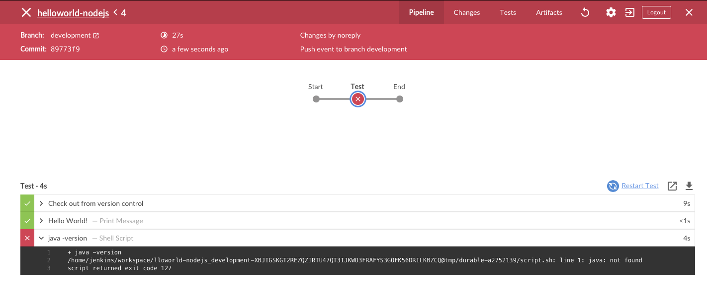

>NOTE: If you waited for your job to complete in Blue Ocean before you navigated to the [Pipeline Runs Details View](https://jenkins.io/doc/book/blueocean/pipeline-run-details/#pipeline-run-details-view) you will discover a nice feature where if a particular step fails, the tab with the failed step will be automatically expanded, showing the console log for the failed step as you can see in the image above.

5. We will fix the error in the **Test** `stage` we added above by replacing the `sh 'java -version'` step with the following step:
```
  sh 'node --version'
```
6. Run the **helloworld-nodejs** job again and it will complete successfully with the following output: <p>

>**NOTE:** If you were to add back the sh 'java -version' step before or after the `container('nodejs')` it would complete successfully as it would be using the default `jnlp` container to execute any steps not in a `container` block.

## Conditional Execution with `when`

In this exercise we will edit the `nodejs-app/Jenkinsfile.template` Pipeline script in the **custom-marker-pipelines** repository by adding some conditional logic based on the **helloworld-nodejs** repository branch being built using the [`when` directive](https://jenkins.io/doc/book/pipeline/syntax/#when). We will accomplish this by adding a branch specific `stage` to the `nodejs-app/Jenkinsfile.template` Pipeline script and then creating a new **development** branch in your forked **helloworld-nodejs** repository.

>**NOTE:** Even though we are adding the conditional logic to the `nodejs-app/Jenkinsfile.template` Pipeline script in the **custom-marker-pipelines** repository we are actually creating a new branch in the **helloworld-nodejs** repository which is the one configured as the **Repository** for the **helloworld-nodejs** Multibranch Pipeline project on your Team Master.  <p>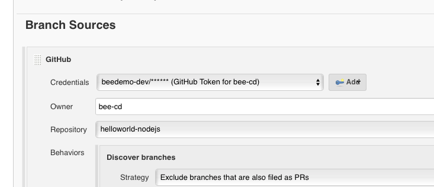

1. Navigate to and open the GitHub editor for the **nodejs-app/Jenkinsfile.template** file in your forked **custom-marker-pipelines** repository
2. Insert the following stage after the existing **Test** stage, commit the change and note the `beforeAgent true` option - this setting will result in the `when` condition being evaluated before acquiring an `agent` for the `stage`:

```
    stage('Build and Push Image') {
      when {
         beforeAgent true
         branch 'master'
      }
      steps {
         echo "TODO - build and push image"
      }
    }
```
3. Next, in GitHub, navigate to your forked **helloworld-nodejs** repository - click on the **Branch** drop down menu, type ***development*** in the input box, and then click on the blue box to create the new branch - ***Create branch: development*** <p>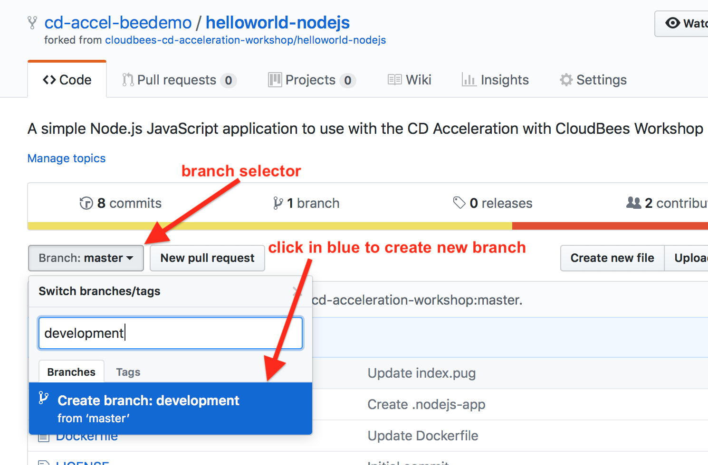
4. Navigate to the **helloworld-nodejs** job in Blue Ocean on your Team Master. You should see that a new Pipeline job for the new branch was created automatically (thanks to the GitHub webhook that was created earlier when we created the GitHub Organization project) and the job should be running or queued to run. Note that the ***Build and Push Image*** `stage` was skipped. <p>

>NOTE: Creating the new ***development*** branch in GitHub triggered the webhook that was auto-created when you created the GitHub Organization project on your Team Master resulting in a new Pipeline job automatically being created for the ***development*** branch in the **helloworld-nodejs** Multibranch Pipeline folder. Up until now we hadn't made any commits in your forked **helloworld-nodejs** repository so no webhook events were triggered to kick-off the job on your Team Master. In the image below, note the two branch jobs and the ***Push event*** that triggered the creation of the new **development** job and kicked-off a run for that branch.
<p>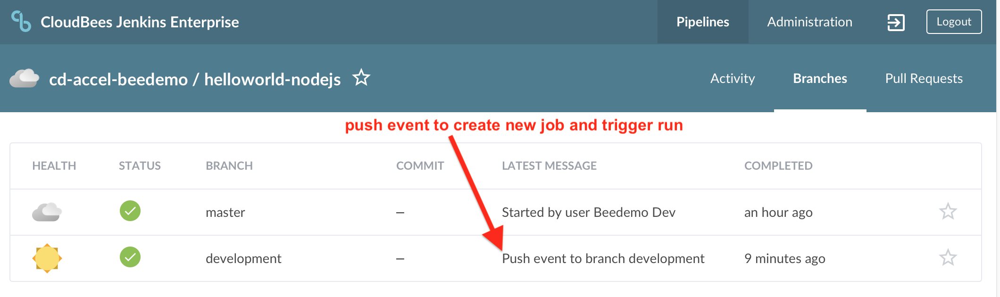

5. Navigate to the **master** branch of your **helloworld-nodejs** job in Blue Ocean on your Team Master and run the job. The new conditional ***Build and Push Image*** `stage` will now run. <p>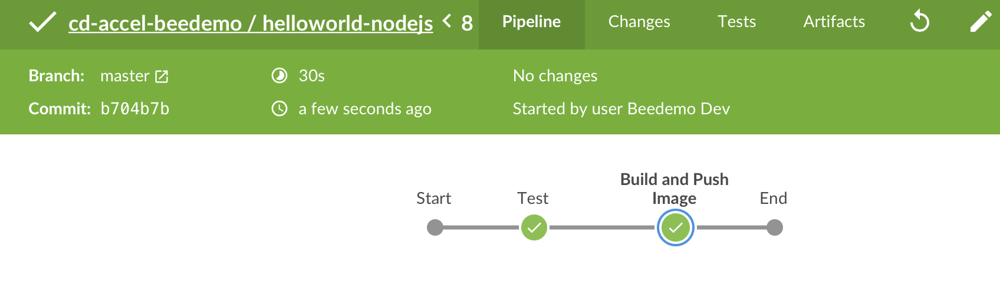

## Stage Specific Agents and Agent None

Up to this point we have had only one global `agent` defined and it is being used by all `stages` of our `pipeline`. However, we don't need an agent for the **Build and Push Image** `stage` (we will be adding Pipeline shared library custom steps later that will provide agents for that and other additional stages). We will update the Pipeline to have no global `agent` and using the current global `nodejs-app` `agent` just for the **Test** `stage`.

1. Navigate to and open the GitHub editor for the **nodejs-app/Jenkinsfile.template** file in the **master** branch of your forked **custom-marker-pipelines** repository.
2. Replace the global `agent` section with the following:

```
  agent none
```

3. Next, in the 'Test' `stage` add the following `agent` section right above the `steps` section:

```
    agent { label 'nodejs-app' }
```

4. You may be asking yourself how the `steps` are able to run in the `stages` where there is no `agent`. Every Pipeline script runs on the Jenkins master using a flyweight executor (i.e. Java thread). However, certain Pipeline `steps` require a heavyweight executor - that is an executor on an `agent` ([more info on flyweight vs heavyweight executors](https://support.cloudbees.com/hc/en-us/articles/360012808951-Pipeline-Difference-between-flyweight-and-heavyweight-Executors)). One such step is the `sh` step. We will add such a step to the **Build and Push Image** `stage` to illustrate this. Add an `sh` step to the **Build and Push Image** stage after the `echo` step so the stage looks like the following:

```
    stage('Build and Push Image') {
      when {
        beforeAgent true
        branch 'master'
      }
      steps {
        echo "TODO - build and push image"
        sh 'java -version'
      }
    }
```

5. Navigate to the **master** branch of your **helloworld-nodejs** job in Blue Ocean on your Team Master and run the job. It will result in the job failing with the following error: 

```
Required context class hudson.FilePath is missing
Perhaps you forgot to surround the code with a step that provides this, such as: node
Attempted to execute a step that requires a node context while ‘agent none’ was specified. Be sure to specify your own ‘node { ... }’ blocks when using ‘agent none’.
```

1. Open the GitHub editor for the **Jenkinsfile** file in the **master** branch of your forked **helloworld-nodejs** repository and remove the `sh 'java -version'` step from the **Build and Push Image** `stage` and commit the changes.
2. The commit will trigeger the **helloworld-nodejs** **master** branch job again and it will complete successfully.

## Next Lesson

Before moving on to the next lesson you can make sure that your **Jenkinsfile** Pipeline script is correct by comparing to or copying from the **after-intro** branch of your forked **custom-marker-pipelines** repository.

You may proceed to the next set of exercises - **[Pipeline Approvals, Post Actions and Notifications with CloudBees Core](./approvals-post-cb-core.md)** - when your instructor tells you.