# Introduction to Declarative Pipelines with CloudBees Core

In this first set exercises we will [create a GitHub Org Folder Pipeline project](), get an overview of the [basic fundamentals of the Declarative Pipeline syntax](#basic-declarative-syntax-structure), get an [introduction to Kubernetes based agents](#kubernetes-agents-with-cloudbees-core) and learn how to [add conditional logic to a Declarative Pipeline](#conditional-execution-with-when). But first we have to [add some credentials to our Team Master](#add-github-credentials-to-your-team-master) - a **Username with password** credential for the GitHub Org Folder Pipeline project.

## Add GitHub Credentials to Your Team Master

We must exit the Blue Ocean UI to the Jenkins classic UI to complete the steps in this exercise.

1. Click the ***Go to classic*** button at the top of common section of Blue Ocean’s navigation bar. <p>

Now, we will create a **Username and password** credential using you GitHub username and personal access token. This credential will be used to configure the *GitHub Organization* project we will create and will allow the auto-setup of a GitHub Organization level webhook:

1. Navigate to the top-level of your Team Master - this should be one level-up from where you exit the Blue Ocean UI. You should see a **Manage Jenkins** link in the left navigation menu.
2. Click on the **Credentials** link in the left navigation menu. <p>
3. Click on the **github.com** link under **Stores scoped to Jenkins** <p>
4. Click on **Add Credentials** in the left menu <p> 
5. Fill out the form (**Username with password**)
  - **Username**: Your GitHub user name
  - **Password**: Your GitHub personal access token [created in setup](../Setup.md#create-a-github-personal-access-token) OR [here is the GitHub link to automatically select the required **Personal access token settings** if you haven't alreaedy done it](https://github.com/settings/tokens/new?scopes=repo,read:user,user:email,admin:org_hook,delete_repo)
  - **ID**: Create an ID for your credentials (something like **github-[Your GitHub Usename]**)
  - **Description**: Can be left blank if you want <p>
6. Click on **OK**

## Create a GitHub Organization Folder Pipeline Project

In this exercise we are going to create a special type of Jenkins Pipeline project referred to as an [*Organization Folder*](https://jenkins.io/doc/book/pipeline/multibranch/#organization-folders) and sometimes more specifically a *GitHub Organization* project (this type of project is also [available for Bitbucket](https://plugins.jenkins.io/cloudbees-bitbucket-branch-source) and there is [unofficial support for GitLab](https://github.com/Argelbargel/gitlab-branch-source-plugin)). The Jenkins *GitHub Organization* project will scan a GitHub Organization to discover the Organization’s repositories, automatically creating **managed** [*Multibranch Pipeline* jobs](https://jenkins.io/doc/book/pipeline/multibranch/#creating-a-multibranch-pipeline) for any repository with at least one branch containing a *project recognizer* - typically **Jenkinsfile**. We will use the GitHub Organization that you created in **[Setup - Create a GitHub Organization](./Setup.md#create-a-github-organization)**. A Jenkins *GitHub Organization* project will also utilize a GitHub Organization level ***webhook it creates*** to automatically manage Jenkins jobs - both individual branch jobs and Mutlibranch Pipeline jobs associcated to repositories - when a branch or a repository is deleted from or added to the GitHub Organization.

In order to complete the following exercise you should have [forked the following repository](./Setup.md#fork-the-workshop-repository) into the Github Organization you created in **[Setup - Create a GitHub Organization](./Setup.md#create-a-github-organization)**:

* https://github.com/cloudbees-days/helloworld-nodejs  


Once that repository is forked:

1. **IMPORTANT** Navigate back to the top-level of your **Team Master** and click on the folder with the same name as your **Team Master**. This is important if you want to use [Blue Ocean](https://jenkins.io/projects/blueocean/) to visualize the Pipeline runs, because only jobs under this folder will show up in Blue Ocean.<p>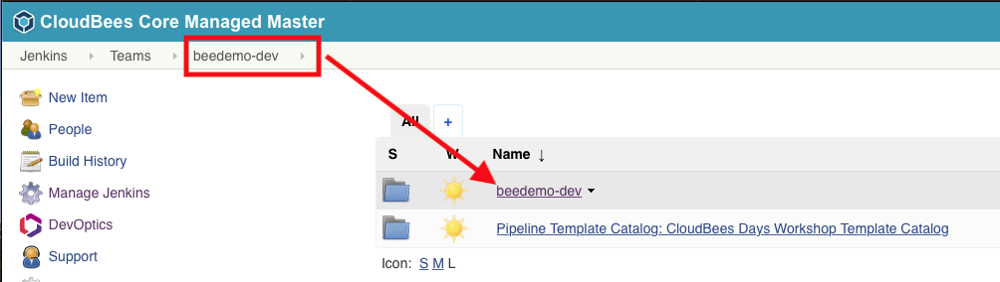 
2. Click on **New Item** in the left navigation menu - make sure that you are in the folder with the same name as your team, and not at the root of your Team Master  <p>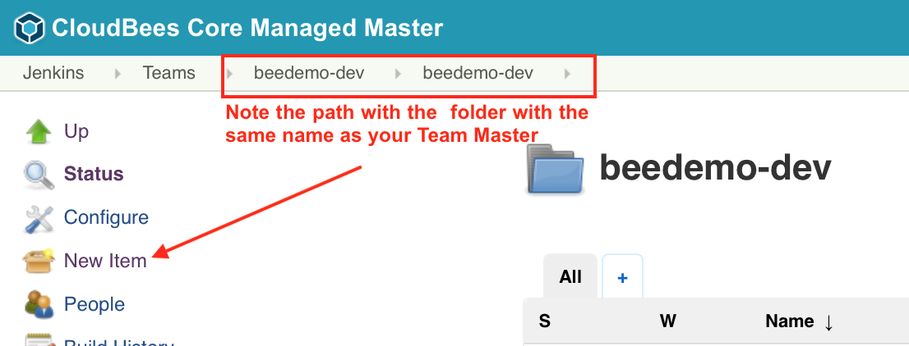
3. Enter your GitHub Organization name as the **Item Name** 
4. Select **GitHub Organization** as the item type
5. Click **Ok** <p>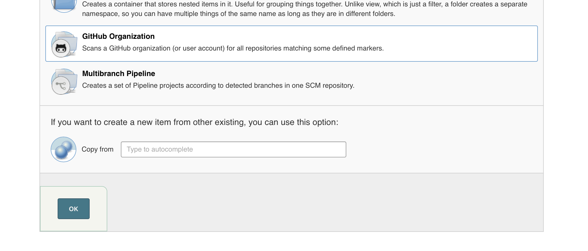
6. Select the credentials you created above from the **Credentials** drop down 
7. Make sure that the **Owner** field matches the name of your GitHub Organization name
8. Click the **Save** button <p>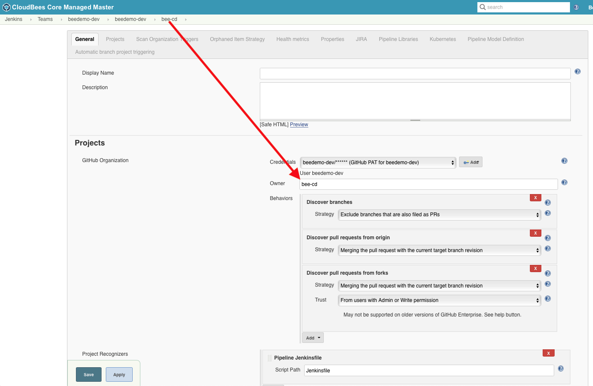
9. Click on the bread-crumb link to go back to your **GitHub Organization** Jenkins Pipeline project folder
10. When the scan is complete your **GitHub Organization** Jenkins Pipeline project should be **empty**!<p>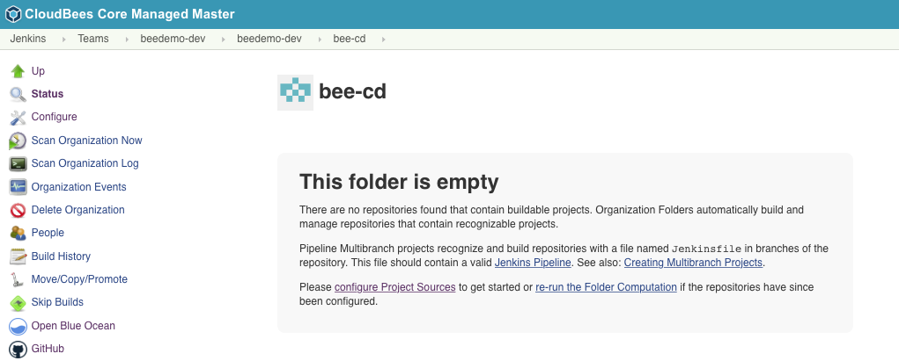
11. However, when the project was created it also should have created a webhook in Github. Verify that the webhook was created in Github by checking the **Webhooks** within your GitHub Organization **Settings**. <p>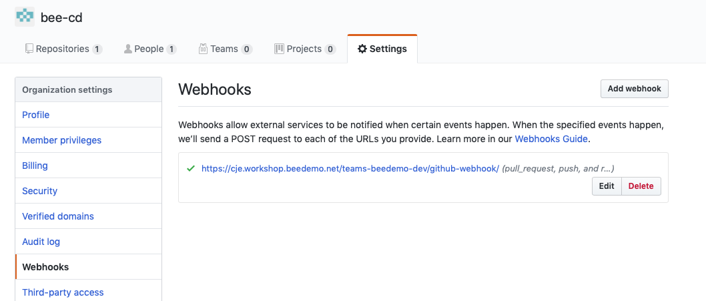
12. The reason why the scan did not find any repositories is because there were no branches in any repository with a `Jenkinsfile` in it, so let's fix that. Navigate to your forked copy of the **helloworld-nodejs** repository and click on the **Create new  file** button towards the top right of the screen. <p>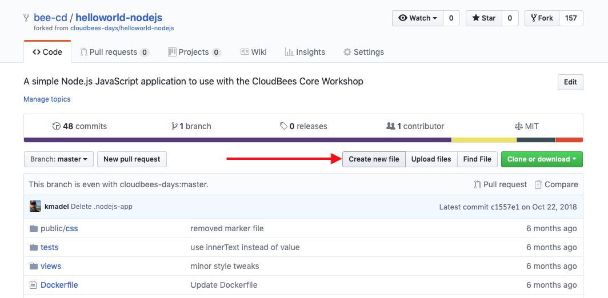
13. Name the file `Jenkinsfile` and add the following content:
```
pipeline {

}
```
14. At the bottom of the screen enter a commit message ***initial Jenkinsfile***, select the **Create a new branch for this commit and start a pull request**, name the branch **development** and click the **Propose new file** button. **IMPORTANT Do Not Create a Pull Request on the next screen after saving** <p>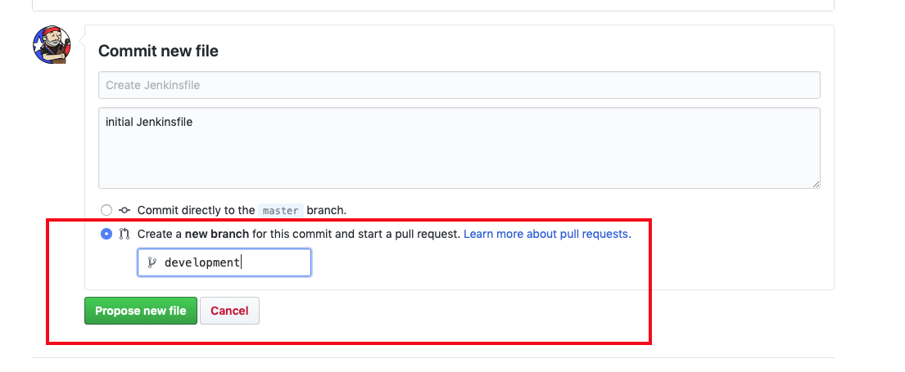 
15. Navigate back to your new **GitHub Organization** Jenkins Pipeline project folder on your Team Master and refresh your browser. If you do not have a new **helloworld-nodejs** Multibranch project then click on the **Scan Organization Now** link in the left menu and then refresh your browser. <p>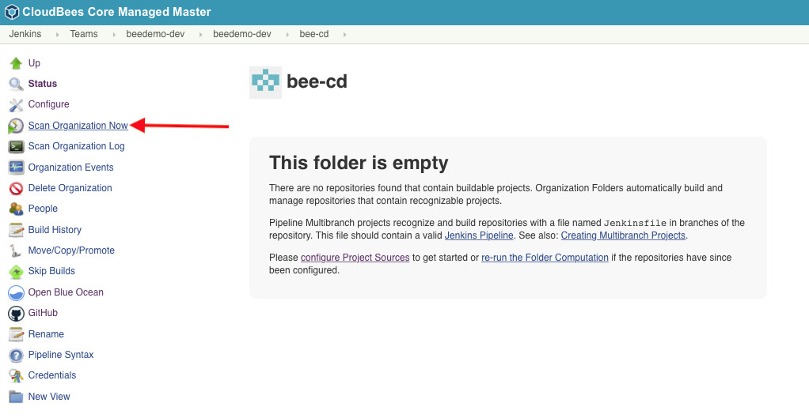
16. You should have a new failed job based on the **development** branch you just added the `Jenkinsfile`. <p>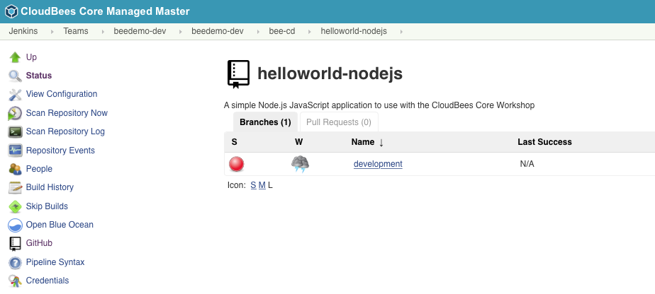

## Basic Declarative Syntax Structure

In the previous lesson your Pipeline ran and will have failed.

In this exercise we will update the Jenkinsfile Declarative Pipeline in your forked copy of the **helloworld-nodejs** repository using the GitHub file editor so that it will run successfully, as opposed to resulting in the following syntax errors:

```
WorkflowScript: 1: Missing required section "stages" @ line 1, column 1.
   pipeline {
   ^

WorkflowScript: 1: Missing required section "agent" @ line 1, column 1.
   pipeline {
   ^

2 errors
```

[Declarative Pipelines](https://jenkins.io/doc/book/pipeline/syntax/#declarative-pipeline) must be enclosed within a `pipeline` block - which we have. But Declarative Pipelines must also contain a top-level `agent` declaration, and must contain exactly one `stages` block at the top level. The `stages` block must have at least one `stage` block but can have an unlimited number of additional `stage` blocks. Each `stage` block must have exactly one `steps` block. 

1. We will use the GitHub file editor to update the `Jenkinsfile` file in your forked **helloworld-nodejs** repository. Navigate to the `Jenkinsfile` file in the **development** branch of your forked repository and then click on the pencil icon in the upper right to edit that file. **IMPORTANT Make sure you are editing the `Jenkinsfile` on your development branch**<p>
2. Replace the contents of that file with the following Declarative Pipeline:

```groovy
pipeline {
  agent any
  stages {
    stage('Say Hello') {
      steps {
        echo 'Hello World!'   
        sh 'java -version'
      }
    }
  }
}
```
<p>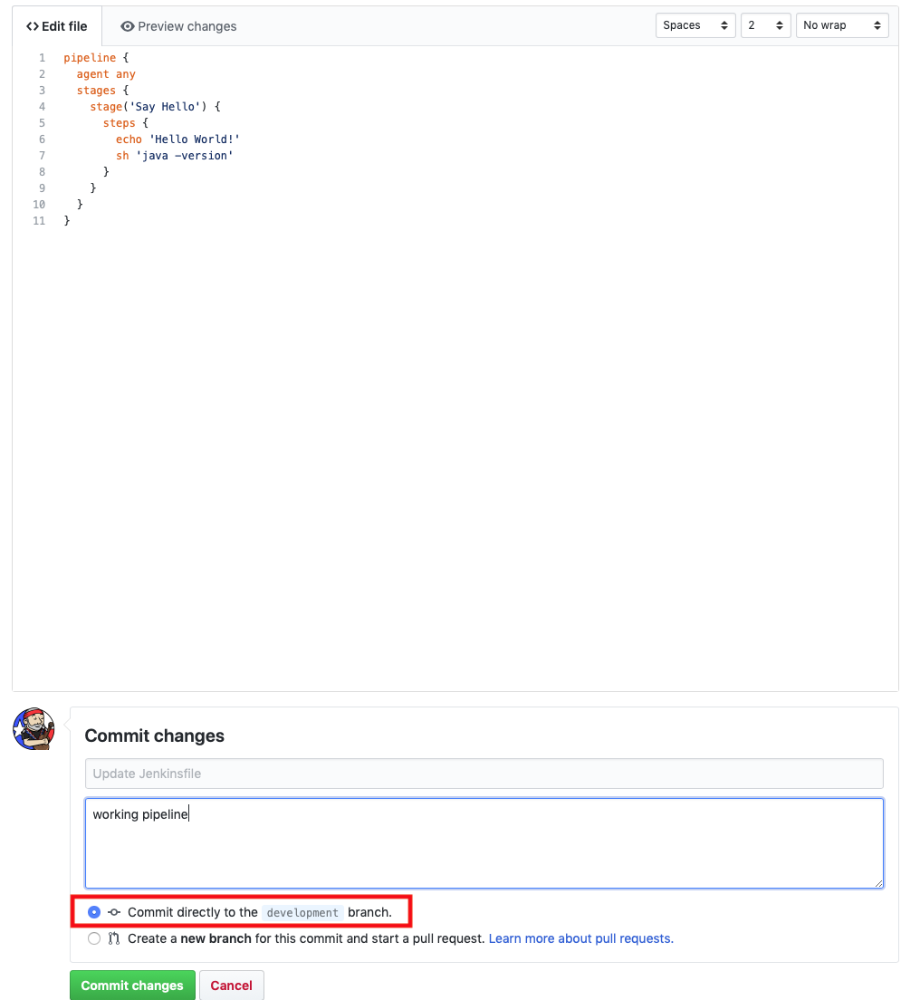<p>

3. Add a commit description and then click the **Commit Changes** button with the default selection of *Commit directly to the `development` branch* selected.
4. Navigate back to the **helloworld-nodejs** *development* branch job on your Team Master and the job will complete successfully. Note some things from the log:
  
   i. The `Jenkinsfile` is being pulled from the **development** branch of your forked **helloworld-nodejs** repository.
   
   ii. The agent is being provisioned from a Kubernetes Pod Template (more on this in the next lesson):

  ```
  ...
  Agent default-jnlp-0p189 is provisioned from template Kubernetes Pod Template
  ...
  ```

   iii. Your fork of the **helloworld-nodejs** repository is being checked out, even though you did not put any steps in the `Jenkinsfile` to do so:

  ```
  ...
  Cloning repository https://github.com/cd-accel-beedemo/helloworld-nodejs.git
  ...
  ```

   iv. The agent has a Java version of `1.8.0_171`:

```
...
Running shell script
+ java -version
openjdk version "1.8.0_171"
...
```
  
> **NOTE:** You may have noticed that your Pipeline GitHub repository is being checked out even though you didn't specify that in your Jenkinsfile. Declarative Pipeline checks out source code by default without the need to explicitly include the `checkout scm` step. Furthermore, this automatic checkout will occur in every `stage` that uses a different agent.

## Next Lesson

Before moving on to the next lesson make sure that your **Jenkinsfile** Pipeline script on the **development** branch of your forked **helloworld-nodejs** repository matches the one from [below](#finished-jenkinsfile-for-introduction-to-pipelines-with-cloudbees-core).


### Finished Jenkinsfile for *Introduction to Pipelines with CloudBees Core*
```
pipeline {
  agent any
  stages {
    stage('Say Hello') {
      steps {
        echo 'Hello World!'   
        sh 'java -version'
      }
    }
  }
}
```

You may proceed to the next lab [*Lab 2. Stage specific agents*](./stage-specific-agents.md) or head back to the main list of the [**labs**](./README.md#workshop-labs) when you are ready.
