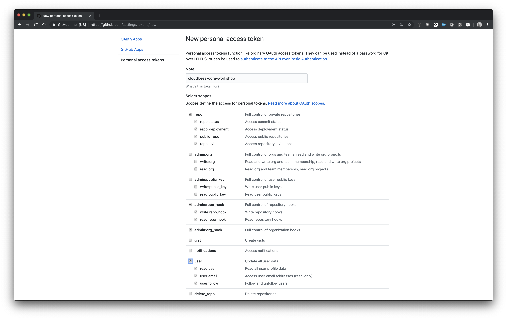

# Create a personal access token in GitHub

Goto http://github.com/settings/tokens to generate a new token as depicted below.

## Generate a new token

Click the Generate new token button and you will be redirected to the following screen.

Name the token in the Note input field in our case: "cloudbees-core-workshop"

Add the following permissions to the Personal Access token:

    - repo: all
    - admin:repo_hook: all
    - admin:org_hook
    - user: all

as depicted below:

Click the Generate token button at the bottom of the screen above to generate the GitHub token which will be used in this workshop.

You may proceed with the workshop [**labs**](./README.md) when you are ready.
