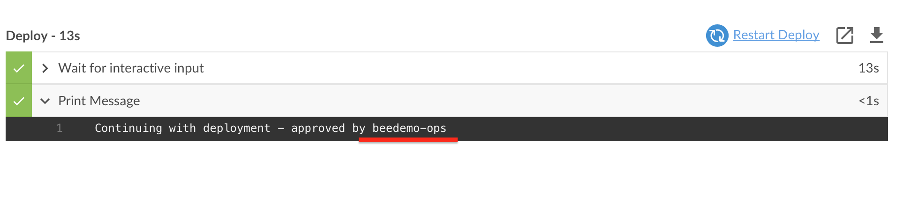

# Pipelines with Interactive Input

In exercise, we will see how you can capture interactive input in your Jenkins Pipeline while it is running.

1. Use the GitHub file editor to update the **Jenkinsfile** file in the **master** branch of your forked **helloworld-nodejs** repository - adding the following `stage` to your Pipeline after the ***Build and Push Image*** `stage` and commit the changes:

```
    stage('Deploy') {
      when {
        beforeAgent true
        branch 'master'
      }
      input {
        message "Should we continue?"
      }
      steps {
        echo "Continuing with deployment"
      }
    }
```

2. Navigate to the **helloworld-nodejs** job in Blue Ocean on your Team Master and the job for the **master** branch should be running or queued to run. Note the `input` prompt during the `Deploy` stage. Go ahead and click the **Proceed** button and the job will complete successfully.  *The `input` prompt is also available in the Console log and classic Stage View.* <p>

3. If you hadn't clicked on either the **Proceed** or **Abort** button in the `input` prompt then your Team Master would haved waited indefinitely for a user response. Let's fix that by setting a timeout. Earlier we used `options` at the global `pipeline` level to set the ***Discard old builds*** strategy for your Team Master with the `buildDiscarder` `option`. Now we will configure `options` at the `stage` level. We will add a `timeout` `option` for the **Deploy** `stage` using the [`stage` `options` directive](https://jenkins.io/doc/book/pipeline/syntax/#stage-options). Update the **Deploy** `stage` to match the following in the **master** branch and then commit the changes:

```
    stage('Deploy') {
      when {
        beforeAgent true
        branch 'master'
      }
      options {
        timeout(time: 30, unit: 'SECONDS') 
      }
      input {
        message "Should we continue?"
      }
      steps {
        echo "Continuing with deployment"
      }
    }
```

4. Navigate to the **helloworld-nodejs** job in Blue Ocean and wait at least 30 seconds after the 'Deploy' `stage` starts. Your pipeline will be automatically **aborted** 30 seconds after the 'Deploy' `stage` starts.<p> <p>Run it again if you would like - but this time click the **Proceed** button before 30 seconds expires - the job will complete successfully.

## Input Approval for Team Members

The `input` directive supports a [number of interesting configuration options](https://jenkins.io/doc/book/pipeline/syntax/#configuration-options). In this exercise we are going to use the `submitter` option to control what Team Master member is allowed to submit the `input` directive. But first you need to add another member to your CloudBees Team Master. Team Masters provide an easy to use authorization model right out-of-the-box. The following roles are available ([there is a CLI to add or modify roles](https://go.cloudbees.com/docs/cloudbees-core/cloud-admin-guide/cje-ux/#_team_roles)):

- **Team Admin:** administrator of the Team Master.
- **Team Member:** read, write and execute permission on the pipelines.
- **Team Guest:** read only.

We want to add a **Team Guest** to our Team Masters and then set that Team member as the `submitter` for our `input` directive. Before you begin, pick a person near you to pair up with. The two of you will share each other's Jenkins account names. You will use that account name when adding a new member to your Team Master below:

1. On your Team Master, navigate to the Team list by clicking on the ***Administration*** link on the top right (this link is available on all Blue Ocean pages except for the [Pipeline Run Details view](https://jenkins.io/doc/book/blueocean/pipeline-run-details/#pipeline-run-details-view)). <p>
2. Next, click on the cog icon for your team.  <p>
3. Click on the ***Members*** link in the left menu and then click on the ***Add a user or group*** link. <p>
4. Select **Team Guest** from the role drop-down, enter the account name for the person next to you in the ***Add user or group*** input (I will use **beedemo-ops**), press your ***enter/return*** key, and then click the **Save changes** button.  <p>
5. Click on the ***Pipelines*** link in the top menu. <p>

Now that we all have a new team member, you can add them as a `submitter` for the `input` directive in your `Jenkinsfile` Pipeline script.

1. Use the GitHub file editor to update the **Jenkinsfile** file in the **master** branch of your forked **helloworld-nodejs** repository - updating the `input` directive of the **Deploy** `stage` with the following changes (replacing **beedemo-ops** with Jenkins username of your new **Team Guest** member). Also, update the `timeout` duration to give your approver plenty of time to submit the `input`:

```
      options {
        timeout(time: 60, unit: 'SECONDS') 
      }
      input {
        message "Should we deploy?"
        submitter "beedemo-ops"
        submitterParameter "APPROVER"
      }
```

2. So, we added one additonal configuration option for our `input` directive: `submitterParameter`. Setting the  `submitterParameter` option will result in a Pipeline environmental variable named `APPROVER` being set with the value being the username of the user that submitted the `input`. In the example above it will either be **beedemo-ops**. Update the `steps` section so the `echo` step in your `Jenkinsfile` Pipeline script will print the `APPROVER` environmental variable and then commit the changes:

```
      steps {
        echo "Continuing with deployment - approved by ${APPROVER}"
      }
```

3. Navigate to the **master** branch of your **helloworld-nodejs** job in Blue Ocean on your Team Master. If you attempt to approve the `input` you will get an error: <p>
4. The ***submitter*** needs to navigate to the **master** branch of your **helloworld-nodejs** job on your Team Master to approve the `input` of your **helloworld-nodejs** Pipeline. You can use the *Team switcher* to quickly navigate to another Team Master that you are a member. The *Team switcher* drop-down will appear in the top right of your screen once you have been added as a member to another Team Master. The ***submitter*** needs to switch to the Team where they are a *Team Guest* member by selecting that team from the *Team switcher* drop-down. <p>
5. As the ***submitter*** navigate to the **helloworld-nodejs** job on your new team and approve the `input`. Note the output of the `echo` step. <p>

>**NOTE:** If you select a Pipeline job as a *favorite* you will be able to see things like jobs awaiting `input` submission in the Blue Ocean **Dashboard**. 

<p>

Before moving on to the next lesson make sure that your **Jenkinsfile** Pipeline script is correct by comparing to or copying from [below]().

### Finished Jenkinsfile for *Pipeline Approvals with Interactive Input*
```
pipeline {
  agent none
  options { 
    buildDiscarder(logRotator(numToKeepStr: '2'))
    skipDefaultCheckout true
  }
  stages {
    stage('Test') {
      agent { label 'nodejs-app' }
      steps {
        checkout scm
        container('nodejs') {
          echo 'Hello World!'   
          sh 'node --version'
        }
      }
    }
    stage('Build and Push Image') {
      when {
        beforeAgent true
        branch 'master'
      }
      steps {
        echo "TODO - build and push image"
      }
    }
    stage('Deploy') {
      when {
        beforeAgent true
        branch 'master'
      }
      options {
        timeout(time: 60, unit: 'SECONDS') 
      }
      input {
        message "Should we deploy?"
        submitter "beedemo-ops"
        submitterParameter "APPROVER"
      }
      steps {
        echo "Continuing with deployment - approved by ${APPROVER}"
      }
    }
  }
}
```

You've reached the end of the workshop! You can head back to the main list of [**labs**](./README.md#workshop-labs) if you like.