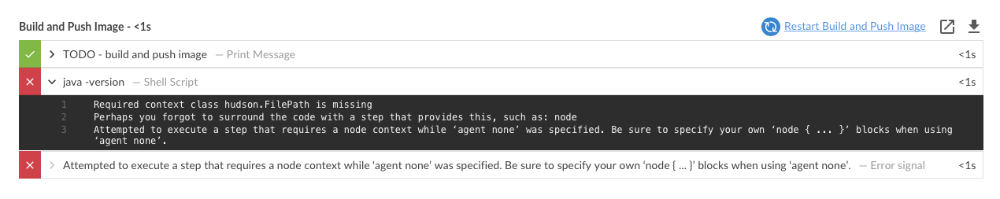

# Stage Specific Agents

In this exercise we will explore stage specific agents, a more advanced usage of the Kubernetes plugin by defining a Pod Template inline in our Pipeline Jenkinsfile.

## Stage Specific Agents and Agent None

Up to this point we have had only one global `agent` defined and it is being used by all `stages` of our `pipeline`. However, we don't need an `agent` for the ***Build and Push Image*** `stage`. We will update the Pipeline to have **no** global `agent` and use the current global `nodejs-app` `agent` just for the Test `stage`.

1. Open the GitHub editor for the `Jenkinsfile` file in the **development** branch of your forked **helloworld-nodejs** repository.
2. Replace the global `agent` section with the following:
```
  agent none
```

3. Next, in the **Test** `stage` add the following `agent` section right above the `steps` section:
```
    agent { label 'nodejs-app' }
```
4. You may be asking yourself how the `steps` are able to run in the `stages` where there is no `agent`. Every Pipeline script runs on the Jenkins Master using a **flyweight executor** (i.e. Java thread). However, certain Pipeline `steps` require a heavyweight executor - that is an executor on an `agent` ([more info on flyweight vs heavyweight executors](https://support.cloudbees.com/hc/en-us/articles/360012808951-Pipeline-Difference-between-flyweight-and-heavyweight-Executors)). One such step is the `sh` step. We will add such a step to the ***Build and Push Image*** `stage` to illustrate this. Add an `sh` step to the ***Build and Push Image*** `stage` after the `echo` step so the stage looks like the following:
```
    stage('Build and Push Image') {
      when {
        beforeAgent true
        branch 'master'
      }
      steps {
        echo "TODO - build and push image"
        sh 'java -version'
      }
    }
```
5. Commit the changes and navigate to the **helloworld-nodejs** job in Blue Ocean on your Team Master and the job for the **development** branch should be running or queued to run. The job will fail with the following error: <p>
6. Open the GitHub editor for the `Jenkinsfile` file in the **development** branch of your forked helloworld-nodejs repository
7. Remove the `sh 'java -version'` step from the ***Build and Push Image*** `stage` and commit the changes to the **development** branch.
8. The commit will trigger the **helloworld-nodejs** **development** branch job again and it will complete successfully.

You may proceed to the next set of [**labs**](./README.md#workshop-labs) - when your are you ready with this lab.
